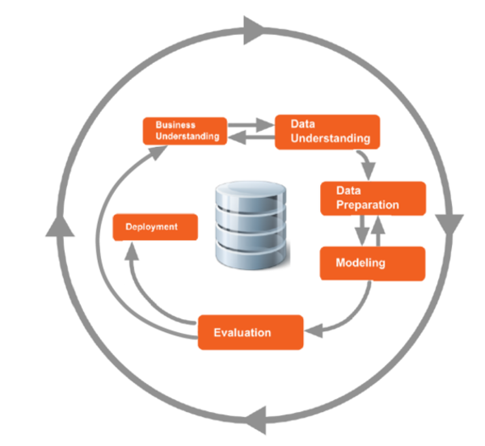
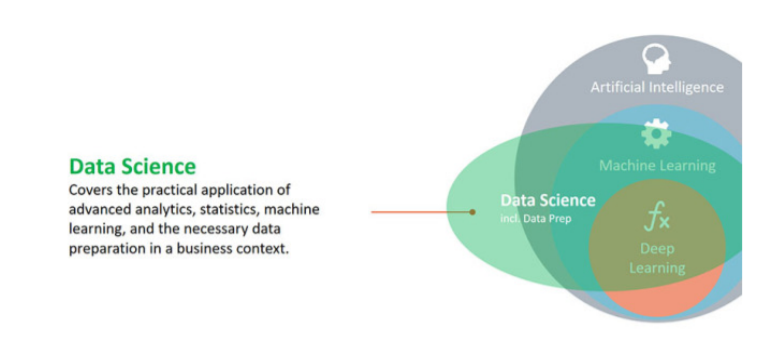
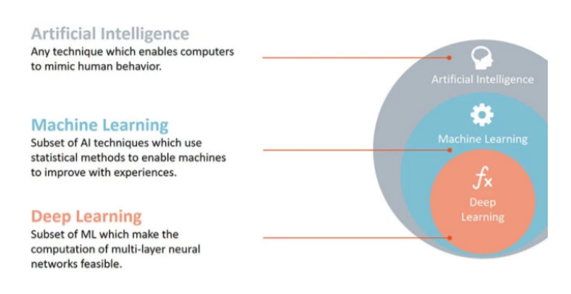
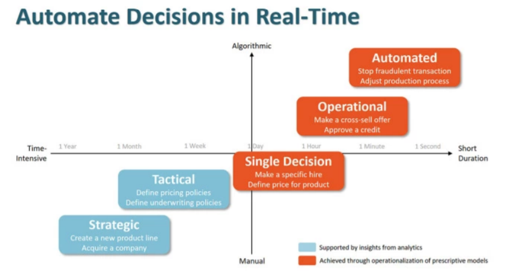
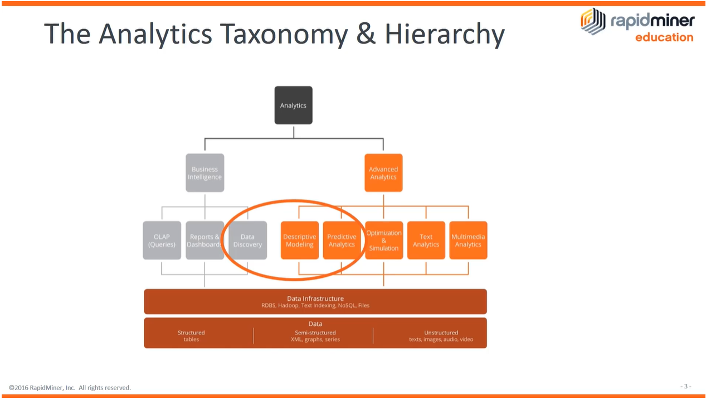
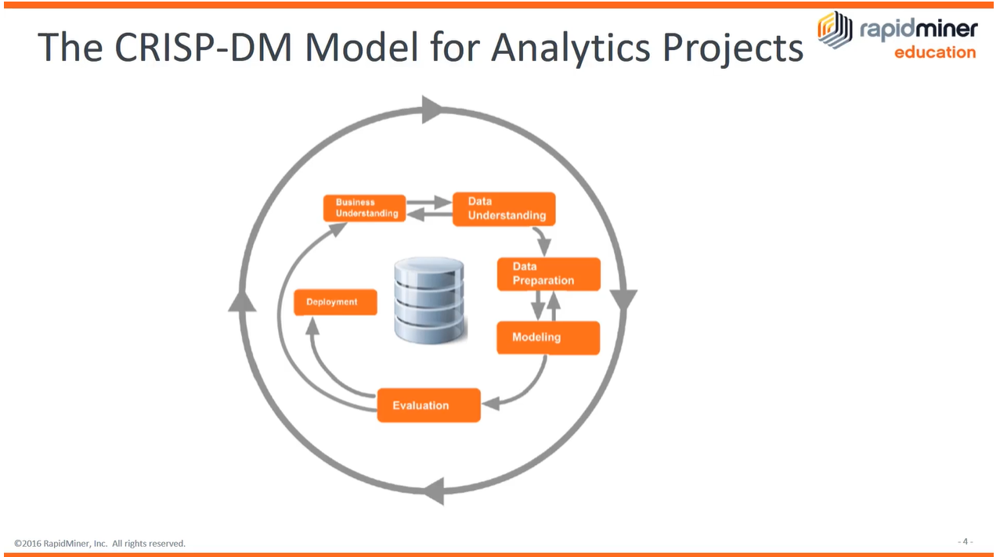

https://academy.rapidminer.com/learn/course/applications-use-cases-professional/

---

# Uygulamalar ve Kullanım Kutuları Profesyonel

## Giriş ve Hoşgeldiniz

Uygulamalar ve Kullanım Kutuları Profesyonel'e Hoş Geldiniz!

Bu, Makine Öğrenmesi İçin Uygulamalar ve Kullanım Durumları ile ilgilenen herkes için tasarlanmış erişilebilir bir kurstur. Neyin değerini sağlayabileceğine dair bir işletme anlayışıyla başlayabileceğinizden emin olmak istiyoruz ve bunu değer katabilmesi için takip edin. Bir modeli işletmeye yerleştirmek için modelin geçerli olduğuna güvenmeniz gerekir. Veri hazırlamanın ayrıntılarını veya modelin iç işleyişini bilmeniz gerekmez, ancak genel süreci ve nasıl değerlendirildiğini ve onaylandığını anlamanız gerekir.

Kurs, Başvuru ve Kullanım Vakaları Profesyonel Sınavına hazırlanmanıza yardımcı olabilir. Sınavdaki tüm soruların cevaplarını kapsamıyoruz, bunun yerine ana hatları çizdiğimiz konuları öğrenme, anlama ve uygulama için sahiplenmenizi rica ediyoruz.

*Lütfen bu yolları sık sık güncellediğimizi ve iyileştirme için herhangi bir öneri duyduğumuza mutlu olduğumuzu unutmayın.*

## AI Temelleri, Veri Bilimi ve Makine Öğrenmesi

### Veri Bilimine Giriş ve Makine Öğrenmesi Türleri

#### Veri Bilimi Nedir?

Yaygın olarak kullanılan terimlerin bazılarını açığa çıkarmakla başlayalım ...

> 
>
> Data Science is the practical application of all those elds (AI, ML, DL) in a business
> context.  “Business” here is a exible term since it could also cover a case where you
> work on scientic research.  In this case your “business” is science.  Which actually is
> more true than you want to think about.
> But whatever the context of your application is, the goals are always the same:
> extracting insights from data,
> predicting developments,
> deriving the best actions for an optimal outcome,
> or sometimes even perform those actions in an automated fashion.
> As you can also see in the diagram above, Data Science covers more than the
> application of only those techniques.  It also covers related elds like traditional
> statistics and the visualization of data or results.   Finally, Data Science also includes
> the necessary data preparation to get the analysis done.  In fact, this is where you will
> spend most of your time on as a data scientist.
> A more traditional denition describes a data scientist as somebody with
> programming skills, statistical knowledge, and business understanding. And while
> this indeed is a skill mix which allows you to do the job of a data scientist, this
> denition falls a bit short.  Others realized this as well which led to a battle of Venn
> diagrams.
> The problem is that people can be good data scientists even if they do not write a
> single line of code. And other data scientists can create great predictive models with
> the help of the right tools.  But without a deeper understanding of statistics.  So the
> “unicorn” data scientist (who can master all the skills at the same time) is not only
> overpaid and hard to nd.  It might also be unnecessary.
> For this reason, I like the denition above more which focuses on the “what” and less
> on the “how”.  Data scientists are people who apply all those analytical
> techniques and the necessary data preparation in the context of a business
> application.  The tools do not matter to me as long as the results are correct and
> reliable.

#### Yapay Zeka (AI), Makine Öğrenmesi ve Derin Öğrenme Nedir?

Biri, diğerinin parçası olan, diğerinin bir parçası! Bir dakika ne...??? Hangisi ve hangisi? RapidMiner'ın Kurucusu ve Baş Veri Bilimcisi Ingo Mierswa tarafından yazılan bu belge karışıklığı gidermeye yardımcı olacak ve herkes için.

> There is hardly a day where there is no news on articial intelligence in the media.  Below
> is a short collection of some news headlines from the past 24 hours only:
>
> - *Articial Intelligence Comes to Hollywood – Is your job safe?*
> - *This robot explains why you shouldn’t worry about articial intelligence* – yes,
>   that’s right.  A talking robot is surely doing the trick of NOT freaking out the
>   nay-sayers even more…
> - *How articial intelligence learns to be racist – simple: it’s mimicking us*
> - *How Articial Intelligence Might Transform the Engineering Industry*
>
> It is interesting that most of those articles have a skeptical, if not even negative tone. 
> This sentiment was also fueled with statements of Bill Gates, Elon Musk, or even Stephen
> Hawking.  With all due respect, but I would not stand in public talking nonsense about
> wormholes so we should all focus a bit more on the areas we are experts in.
> This all underlines two things: articial intelligence and machine learning nally became
> mainstream. And people know shockingly little about it.
> There is also a high dose of hype around those topics.  We all heard about “Linear
> Regression” before. This should not come as a surprise since it was already invented
> more than 200 years ago by Legendre and Gauss.  And still this overdose of hype can
> lead to situations where people are a little bit carried away whenever they use this
> method.  Here is one of my favorite tweet exchanges which exemplies this:
> Anyway, there is high level of confusion around those terms. This post should help to
> understand the dierences and relationships of those elds. Let’s get started with the
> following picture. It explains the three terms articial intelligence, machine learning, and
> deep learning:
> @katherinebailey Because marketing? Everytime someone calls simple linear
> regression “AI” Gauss turns over in his grave.
> — RapidMiner (@RapidMiner) April 15, 2017
>
> 
>
> Articial Intelligence is covering anything which enables computers to behave like a
> human.  Think of the famous – although a bit outdated – Turing test to determine if this
> is the case or not.  If you talk to Siri on your phone and get an answer, this is close
> already.  Automatic trading systems using machine learning to be more adaptive would
> also already fall into this category.
> Machine Learning is the subset of Articial Intelligence which deals with the extraction of
> patterns from data sets. This means that the machine can nd rules for optimal behavior
> but also can adapt to changes in the world. Many of the involved algorithms are known
> since decades and sometimes even centuries. But thanks to the advances in computer
> science as well as parallel computing they can now scale up to massive data volumes.
> Deep Learning is a specic class of Machine Learning algorithms which are using complex
> neural networks.  In a sense, it is a group of related techniques like the group of “decision
> trees” or “support vector machines”.  But thanks to the advances in parallel computing
> they got quite a bit of hype recently which is why I broke them out here. As you can see,
> deep learning is a subset of methods from machine learning.  When somebody explains
> that deep learning is “radically dierent from machine learning“, they are wrong.  But if
> you would like to get a BS-free view on deep learning, check out this webinar I did some
> time ago.
> But if Machine Learning is only a subset of Articial Intelligence, what else is part of this
> eld?  Below is a summary of the most important research areas and methods for each
> of the three groups:
> Articial Intelligence: Machine Learning (duh!), natural language understanding,
> language synthesis, computer vision, robotics, sensor analysis, optimization &
> simulation, among others.
> Machine Learning: Deep Learning (another duh!), support vector machines,
> decision trees, Bayes learning, k-means clustering, association rule learning,
> regression, and many more.
> Deep Learning: articial neural networks, convolutional neural networks,
> recursive neural networks, long short-term memory, deep belief networks,
> and many more.
> As you can see, there are dozens of techniques in each of those elds. And researchers
> generate new algorithms on a weekly basis.  Those algorithms might be complex.  **The**
> **conceptual dierences like explained above are not.**

#### What Artificial Intelligence and Machine Learning CAN do – and what NOT

By now you should be clear on the terminology but what's behind the hype? Is this AI-ML-Data-Science-Deep-learning stuff going to change the way of how you and everyone does business and can it help you to gain a competitive advantage? As so often the answer is: "It depends". This brief article by RapidMiner's Ingo Mierswa may help to get some clarity.

> 
>
> I have written on Articial Intelligence (AI) before.  Back then I focused on the technology
> side of it: what is part of an AI system and what isn’t.  But there is another question which
> might be even more important.  What are we DOING with AI?
> Part of my job is to help investors with their due diligence.  I discuss companies with
> them in which they might want to invest. Here is a quick observation:  By now, every
> company pitch is full with stu about how they are using AI to solve a given business
> problem.
> Part of me loves this since some of those companies are on something and should get
> the chance.  But I also have a built-in “bullshit-meter”.  So, another part of me wants to
> cringe every time I listen to a founder making stu up about how AI will help him.  I
> listened to many founders who do not know a lot about AI, but they sense that they can
> get millions of dollars of funding.  Just by adding those uy keywords to their pitch.  The
> bad news is that it sooner or later actually works.  Who am I to blame them?
> I have seen situations where AI or at least machine learning (ML) has an incredible
> impact.  But I also have seen situations where this is not the case.  What was the
> dierence?
> In most of the cases where organizations fail with AI or ML, they used those techniques in
> the wrong context.  ML models are not very helpful if you have only one big decision you
> need to make.  Analytics still can help you in such cases by giving you easier access to the
> data you need to make this decision.  Or by presenting this data in a consumable
> fashion.  But at the end of the day, those single big decisions are often very strategic. 
> Building a machine learning model or an AI to help you making this decision is not worth
> doing it.  And often they also do not yield better results than just making the decision on
> your own.
> Here is where ML and AI can help. Machine Learning and Articial Intelligence deliver
> most value whenever you need to make lots of similar decisions quickly. Good
> examples for this are:
> Dening the price of a product in markets with rapidly changing demands,
> Making oers for cross-selling in an E-Commerce platform,
> Approving a credit or not,
> Detecting customers with a high risk for churn,
> Stopping fraudulent transactions,
> …among others.
> You can see that a human being who would have access to all relevant data could make
> those decisions in a matter of seconds or minutes.  Only that they can’t without AI or ML,
> since they would need to make this type of decision millions of times, every day.  Like
> sifting through your customer base of 50 million clients every day to identify those with a
> high churn risk.  Impossible for any human being.  But no problem at all for an ML
> model.
> So, the biggest value of articial intelligence and machine learning is not to support us
> with those big strategic decisions.  Machine learning delivers most value when we
> operationalize models and automate millions of decisions.
> The image below shows this spectrum of decisions and the times humans need to make
> those.  The blue boxes are situations where analytics can help, but it is not providing its
> full value. The orange boxes are situations where AI and ML show real value. And the
> interesting observation is: the more decisions you can automate, the higher this value
> will be (upper right end of this spectrum).
>
> 
>
> One of the shortest descriptions of this phenomenon comes from Andrew Ng, who is a
> well-known researcher in the eld of AI.  Andrew described what AI can do as follows:
>
> 	“If a typical person can do a mental task with less than one second of thought,
>
> we can probably automate it using AI either now or in the near future.”
>
> I agree with him on this characterization. And I like that he puts the emphasis on
> automation and operationalization of those models – because this is where the biggest
> value is. The only thing I disagree with is the time unit he chose. It is safe to go already
> with a minute instead of a second.

#### RapidMiner and CRISP-DM

Learn about different parts of the RapidMiner ecosystem. It is useful to understand where it fits with everything else. Then begin to organize your work in RapidMiner Studio and setup your environment. Learn about the overall process of Data Mining and Machine Learning with the CRISP-DM process.

### From Descriptive to Predictive and Prescriptive

#### Introduction To Advanced Analytics

Advanced Analytics is defined as: "The analysis of all kinds of data using sophisticated quantitative methods (for example, statistics, descriptive and predictive data mining, simulation and optimization) to produce insights that traditional approaches to business intelligence (BI) — such as query and reporting — are unlikely to discover."

This only begins to scratch the surface of the field. Analytics is an immense field with many subfields, so it can be difficult to sort out all the buzzwords around it. This whitepaper outlines the differences between Advanced Analytics, Business Intelligence, and their subfields to provide you with an understanding of how they fit into the overall category of Analytics.

Read this white paper to learn more about the differences between advanced analytics and business intelligence.

[PDF1](assets/o6gw1mun7h8n-advanced-analytics-introduction-16.pdf)

#### Back to the Future or "how to get predictive"

Before you even start figuring out how to create great analytical workflows and solve your problems, you need to make a mapping between your business problem and an analytical technique, and that turns out to be really, really difficult. So, many people out there don't get it right, but it's actually super simple and Ingo is going to explain to you how it boils down to two questions only.

VIDEO

#### Prescriptive Analytics

Ingo Mierswa, RapidMiner's data science wizard, feels a bit left out in the rain but somehow he manages to turn this around into a lecture on prescriptive analytics and telling others if they should bring an umbrella or not. Now that's a positive attitude! He details how prescriptive analytics combines both, machine learning models and optimization schemes. Knowing something about the future is one thing, but actually changing something about the future is more valuable, right? Also Data Scientist #7 shows his true colors...

VIDEO

## **CERTIFICATION**