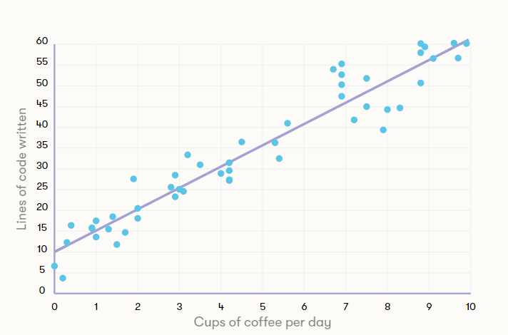

## III .Regresyon

### Bu bölümdeki ana öğrenme hedefimiz, denetimli öğrenme yöntemlerinin bir başka güzel örneğidir ve neredeyse en yakın komşu sınıflandırıcı kadar basit: doğrusal regresyon. Yakın kuzenini, lojistik regresyonunu da tanıtacağız.

> Not
>
> ## Sınıflandırma ve regresyon arasındaki fark
>
> Farklı senaryolarda üretmemiz gereken tahminler türünde küçük ama önemli bir fark var. Örneğin, en yakın komşu sınıflandırıcı, belirli bir alternatif kümeden (spam / non-spam veya 0,1,2, ..., 9 gibi) herhangi bir öğe için bir sınıf etiketi seçerken, doğrusal regresyon olmayan bir sayısal tahmin üretir. bir tamsayı olma kısıtlı (3.14 gibi bir şeye zıt bir tam sayı). Dolayısıyla, lineer regresyon, çıktı değişkeninin bir ürünün fiyatı, bir engele olan mesafe, bir sonraki Star Wars filminin gişe geliri gibi herhangi bir sayı olabileceği durumlarda daha uygundur.
>

Doğrusal regresyonda temel fikir, öngörülen değeri üretmek için özellik değişkenlerinin her birinin etkilerini toplamaktır. Ekleme işlemi için teknik terim *doğrusal kombinasyondur* . Fikir çok basit ve alışveriş faturanızda gösteriliyor olabilir.

> Not
>
> ## Lineer regresyonun alışveriş faturası olarak düşünülmesi
>
> Markete gidip 2.5kg patates, 1.0kg havuç ve iki şişe süt aldığınızı varsayalım. Patatesin fiyatı kg başına 2 € ise, havuç fiyatı kg başına 4 € ve bir şişe süt ücreti 3 € ise, kasiyer tarafından hesaplanan fatura 2,5 × 2 € + 1,0 × 4 € + 2 × 3 € = 15 €. Doğrusal regresyonda patates, havuç ve süt miktarı verilerdeki girdilerdir. Çıktı, satın aldığınız her bir ürünün hem fiyatına hem de miktarına açıkça bağlı olarak alışverişinizin maliyetidir.
>

Doğrusal kelimesi, bir girdi özelliğinin bir miktar sabit miktarda arttırılması durumunda çıktıdaki artışın her zaman aynı olduğu anlamına gelir. Başka bir deyişle, alışveriş sepetinize iki kilo havuç eklediğinizde, fatura 8 € artar. İki kilo daha eklediğinizde, fatura 8 € artar ve yarısı 1kg eklerseniz, fatura tam olarak yarısı 4 € artar.

> Anahtar terminoloji
>
> ## Katsayılar veya ağırlıklar
>
> Doğrusal regresyon terminolojisinde, farklı ürünlerin fiyatları, katsayılar veya ağırlıklar olarak adlandırılır (bu, patates ve havuç miktarını ağırlıkla ölçtüğümüzden, ancak bununla kandırılmanıza izin vermeyeceğimiz için kafa karıştırıcı görünebilir). Doğrusal regresyonun ana avantajlarından biri kolay yorumlanabilirliğidir: öğrenilen ağırlıklar aslında çıktıların tahminlerinden daha ilginç olabilir.
>
> Örneğin, yaşam beklentisini tahmin etmek için doğrusal regresyon kullandığımızda, sigaranın ağırlığı (günde sigara) eksi yılda yaklaşık bir buçuk aydır, yani günde bir kez daha fazla sigara içmeniz sizi sonlandırmanın ortalama yarısına yaklaştırır. Aynı şekilde, sebze tüketiminin (günde bir avuç sebze) ağırlığı da bir yıl artı olduğundan, her gün bir avuç yeşillik tüketmek size ortalama bir yıl daha verir.

------

### Alıştırmalar için ilgili sayfaya gidebilirsiniz.

https://course.elementsofai.com/4/3

---

Yukarıdaki alıştırmada, sigara içmeyen vejetaryalı kadınların 80 yıllık yaşam beklentisi hesaplamanın başlangıç noktası olmuştur. Başlangıç noktası için teknik terim **kesişimdir** . Doğrusal regresyon modellerinin verilerden nasıl öğrenileceğini tartıştığımızda, buna geri döneceğiz.

### Doğrusal regresyon öğrenme

Yukarıda, hem ağırlıklar hem de giriş özellikleri bilindiğinde, tahminlerin doğrusal regresyondan nasıl elde edildiğini tartıştık. Böylece bize girdiler ve ağırlık verildi ve öngörülen çıktıları üretebiliriz.

Çok sayıda öğeye ait girdi ve çıktılar verildiğinde, öngörülen çıktının mümkün olduğu kadar gerçek çıktıyla eşleşeceği şekilde ağırlıkları bulabiliriz. Makine öğrenimi tarafından çözülen görev budur.

> Not
>
> ## Örnek
>
> Alışveriş analojisine devam edersek, bize her bir alışveriş sepetinin içeriği ve her birine toplam fatura verildiğini ve her bir ürünün fiyatını (patates, havuç vb.) bulmamızın istendiğini varsayalım. Bir sepetten 1kg sığır filetosu bifteği, 2kg havuç ve bir şişe Chianti diyelim, toplam faturanın 35 € olduğunu bilmemize rağmen, fiyatları belirleyemedik, çünkü aynı toplam fatura pek çok fiyat getirecektir. Bununla birlikte, çok daha fazla sepetle, genellikle bu sorunu çözebiliriz.

Ancak sorun, gerçek dünyada, belirsizliği veya “gürültüyü” sürece dahil eden çeşitli faktörler nedeniyle, gerçek çıktının, girdi tarafından tam olarak belirlenememesi nedeniyle daha da zorlaştırılmaktadır. Herhangi bir ürünün fiyatlarının zaman zaman değişebileceği bir pazarda veya nihai maliyetin değişken miktarda bahşiş içerdiği bir restoranda alışveriş yapmayı düşünebilirsiniz. Bu gibi durumlarda, fiyatları yalnızca sınırlı bir doğrulukla tahmin edebiliriz.

Eğitim verilerindeki öngörülen ve gerçek çıktılar arasındaki eşleşmeyi optimize eden ağırlıkları bulmak, 1800'lere dayanan klasik bir istatistiksel problemdir ve büyük veri kümeleri için bile kolayca çözülebilir.

Klasik en küçük kareler tekniği gibi gerçek ağırlık bulma algoritmalarının ayrıntılarına, basit olduklarından girmeyeceğiz. Bununla birlikte, aşağıdaki alıştırmalarda verilerde trendleri bulma hissi alabilirsiniz.

### Doğrusal regresyonun görselleştirilmesi

Doğrusal regresyonun bize söyleyebilecekleri hakkında fikir edinmenin iyi bir yolu, verilerimizi ve regresyon sonuçlarımızı içeren bir grafik çizmektir. Basit bir oyuncak örneği olarak, veri kümemizin bir değişkeni, bir çalışanın bir günde içtiği kahve sayısı ve o çalışan tarafından günlük olarak yazılan kod satırı sayısıdır. Bu, açık bir şekilde belirlenmiş gerçek bir veri değildir, çünkü kahve dışında bir çalışanın verimliliğini etkileyen, karmaşık şekillerde etkileşime giren başka faktörler de vardır. Kahve miktarını artırarak verimliliğin artması da, sadece jitterlerin çok fazla dağıttığı belirli bir noktaya dayanacaktır.

Verilerimizi yukarıdaki grafikte bir noktanın bir çalışanı temsil ettiği noktalar olarak sunduğumuzda, daha fazla kahve içmenin daha fazla kod satırında yazıldığına dair bir eğilim olduğunu açıkça görüyoruz (bunun tamamen uydurulmuş hazırlanmış veriler olduğunu hatırlayın) . Bu veri setinden kahve tüketimiyle ilgili katsayısı veya ağırlığı öğrenebiliriz ve göze çarparak zaten beşe yakın bir yerde olduğunu söyleyebiliriz, çünkü tüketilen her kahve için programlanan satır sayısı kabaca beşe kadar yüksel. Örneğin, günde iki fincan kahve içen çalışanlar, günde yaklaşık 20 satır kod üretiyor gibi gözüküyorlar ve benzer şekilde dört fincan kahve de, üretilen satırların sayısı 30 civarında.

Ayrıca kahve içmeyen çalışanların da kod ürettiği ve grafikte yaklaşık on satır olduğu gösterildi. Bu sayı daha önce bahsettiğimiz kesişim terimidir. Kesişme, modelde tıpkı ağırlıklar gibi verilerden öğrenilebilecek başka bir parametredir. Yaşam beklentisi örneğinde olduğu gibi, giriş değişkeninin etkilerini eklemeden önce hesaplamalarımızın başlangıç noktası veya birden fazla varsa değişkenlerin bu örnekteki kahve fincanları veya bir öncekinde sigaralar/sebzeler olduğu düşünülebilir.

Grafikteki çizgi, en küçük kareler denilen gerçek bir doğrusal regresyon tekniği kullanarak kesişme ve katsayısı tahmin ettiğimiz tahmini sonucumuzu gösterir. Bu satır, giriş kahve sayısı olduğunda üretilen satır sayısını tahmin etmek için kullanılabilir. Sadece kısmi fincanlara (yarım, 1/4 fincan vb. Gibi) izin versek bile bir tahmin alabileceğimizi unutmayın.

------

### Alıştırmalar için ilgili sayfaya gidebilirsiniz.

https://course.elementsofai.com/4/3

---

Yukarıdaki alıştırmalarda kullanılanlar gibi çalışmaların nedensel ilişkileri tanımlayamayacağı belirtilmelidir. Başka bir deyişle, yalnızca bu verilerden, çalışmanın aslında daha iyi bilgilendirilmiş ve daha sağlıklı bir yaşam tarzı veya başka mekanizmalar yoluyla yaşam beklentisini arttırıp artırmadığını veya yaşam beklentisi ile eğitim arasındaki görünür ilişkinin temel faktörlerden kaynaklanıp kaynaklanmadığını söylemek mümkün değildir. ikisini de etkiler. Örneğin, insanların yüksek eğitimli olma eğiliminde olduğu ülkelerde, beslenme, sağlık ve güvenlik de daha iyi, muhtemelen yaşam beklentisi artabilir. Bu tür basit bir analizle, yalnızca tahmin için faydalı olabilecek ilişkileri tanımlayabiliriz.

### Lineer regresyonun makine öğrenmesi uygulamaları

Doğrusal regresyon gerçekten birçok yapay zeka ve veri bilimi uygulamasının itici gücüdür. Sınırları vardır, ancak genellikle sadeliği, yorumlanabilirliği ve etkinliği ile telafi edilir. Lineer regresyon aşağıdaki problemlerde birkaç örnek vermek için başarıyla kullanılmıştır:

- çevrimiçi reklamcılıkta tıklama oranlarının tahmini
- ürünler için perakende talebinin tahmini
- Hollywood filmlerinin gişe gelirinin tahmini
- yazılım maliyetinin tahmini
- sigorta maliyetinin tahmini
- suç oranlarının tahmini
- emlak fiyatlarının tahmini

### Etiketleri tahmin etmek için regresyon kullanabilir miyiz?

Yukarıda tartıştığımız gibi, doğrusal regresyon ve en yakın komşu yöntemi (nearest neighbor method) farklı türden tahminler üretmektedir. Lineer regresyon sayısal çıktılar verirken en yakın komşu yöntemi sabit bir alternatifler grubundan (“sınıflar”) etiketler üretir.

Doğrusal regresyonun en yakın komşularla karşılaştırıldığında üstün olduğu durumlarda yorumlanabilirliktir. Bununla ne kastediyoruz? Bir şekilde, en yakın komşu yönteminin ve ürettiği herhangi bir tahminin yorumlanmasının kolay olduğunu söyleyebilirsiniz: bu sadece en yakın eğitim veri öğesidir! Bu doğrudur, ancak öğrenilen modelin yorumlanabilirliği söz konusu olduğunda, belirgin bir fark vardır. Eğitilen modelin en yakın komşulardaki lineer regresyondaki ağırlıklar ile aynı şekilde yorumlanması imkansızdır: öğrenilen model temelde bütün verilerdir ve genellikle bize çok fazla içgörü sağlamak için çok büyük ve karmaşıktır. Öyleyse en yakın komşu, etiketlerle aynı tür çıktılar üreten bir metoda sahip olmak istiyorsak, ancak doğrusal regresyon gibi yorumlanabilirse ne olur?

### Kurtarıcı lojistik regresyon

Sizin için iyi haberlerimiz var: Doğrusal regresyon yönteminin çıktılarını etiketlerle ilgili tahminlere dönüştürebiliriz. Bunu yapmak için teknik lojistik regresyon denir. Tekniklere girmeyeceğiz, en basit durumda, çıktıyı bir sayı olan doğrusal regresyondan alıyoruz ve etiket sıfırdan büyükse bir etiket A'yı, etiket  B etiketini sıfırdan küçük veya ona eşitse tahmin ediyoruz.. Aslında, sadece bir sınıfı ya da diğerini tahmin etmek yerine, lojistik regresyon da bize tahminin belirsizliğini ölçebilir. Biz müşteri bu yıl yeni bir akıllı telefon satın alacak mı öngörüyor. Yani, biz bir müşteri olasılık% 90 ile bir telefon satın alacağını bir tahmin alabilirsiniz, ama diğeri için, daha az tahmin edilebilir müşteri, biz bir tahmin alabilirsiniz onlar olacak *değil* % 55 olasılığı olan bir telefon satın al (veya başka bir deyişle,% 45 olasılıkla bir tane alacaktır).

İkiden fazla olası etiket üzerinde tahminler elde etmek için aynı hileyi kullanmak da mümkündür, bu yüzden her zaman evet veya hayır tahmin etmek yerine (yeni bir telefon satın almak veya değil, sahte haberler veya gerçek haberler vb.) Kullanabiliriz. Örneğin, el yazısı rakamları tanımlamak için lojistik regresyon, bu durumda on olası etiket vardır.

### Lojistik regresyon örneği

Aşçılık dersine giriş yapan öğrencilerin verilerini topladığımızı varsayalım. Öğrenci kimliği, adı, vb. Gibi temel bilgilere ek olarak, öğrencilerden sınav için kaç saat çalıştıklarını bildirmelerini isteriz (ancak bir aşçılık sınavı için çalışıyorsunuz, muhtemelen yemek pişiriyorsunuz?) - ve Raporlarında az ya da çok dürüstler. Sınavdan sonra her öğrencinin dersi geçip geçmediğini öğreneceğiz. Bazı veri noktaları aşağıda sunulmuştur:

| Öğrenci Kimliği | Çalışılan saatler | Geçti / başarısız |
| :-------------- | :---------------- | :---------------- |
| 24              | 15                | Geçti             |
| 41              | 9.5               | Geçti             |
| 58              | 2                 | Başarısız         |
| 101             | 5                 | Başarısız         |
| 103             | 6.5               | Başarısız         |
| 215             | 6                 | Geçti             |

Tabloya göre, çalışılan ve sınavı geçen saatler arasında ne tür bir sonuç çıkartabilirsiniz? Yüzlerce öğrenciden veri alırsak, kursu geçmek için çalışılması gereken miktarı görebiliriz diye düşünebiliriz. Bu verileri aşağıda gördüğünüz gibi bir grafikte sunabiliriz.

------

### Alıştırmalar için ilgili sayfaya gidebilirsiniz.

https://course.elementsofai.com/4/3

------

Lojistik regresyon, finansal risklerin tahmin edilmesi, tıbbi araştırmalarda vb. gerçek dünyadaki AI uygulamalarında da kullanılır. Bununla birlikte, doğrusal regresyon gibi, doğrusallık özelliği ile de sınırlandırılmıştır ve dolayısıyla araç kutumuzda birçok başka yöntemlere ihtiyacımız vardır. Sinir ağlarını tartıştıktan sonra doğrusallık sorununa geri döneceğiz.

### Makine öğreniminin sınırları

Özetlemek gerekirse, makine öğrenmesi AI uygulamaları oluşturmak için çok güçlü bir araçtır. En yakın komşu yöntemine, doğrusal regresyona ve lojistik regresyona ek olarak, binlerce olmasa da, yüzlerce, farklı makine öğrenme teknikleri var, ama hepsi aynı şey temellerinde vardır: ya bir fenomeni anlama ya da gelecekteki sonuçlarını tahmin etme konusunda veriden kalıp ve bağımlılıklar çıkarmaya çalışmak ve kullanmak.

Makine öğrenmesi çok zor bir problem olabilir ve genellikle her zaman doğru etiketi üreten mükemmel bir yöntem elde edemeyiz. Bununla birlikte, çoğu durumda, iyi ancak mükemmel olmayan bir tahmin hiç olmamasından daha iyidir. Bazen kendimizden daha iyi tahminler üretebiliriz, ancak yine de makine öğrenmesini kullanmayı tercih edebiliriz çünkü makine tahminlerini daha hızlı hale getirecek ve yorulmadan tahminleri yeniden oluşturmaya devam edecektir. İyi örnekler, hangi müziğin, hangi videoların veya hangi reklamların sizin için daha fazla ilgi çekici olacağını tahmin etmesi gereken öneri sistemleridir.

Bir sonucun ne kadar iyi olabileceğini etkileyen faktörler şunları içerir:

- Görevin zorluğu: el yazısıyla yazılan rakamların tanınmasında, rakamlar çok eğimli yazılmışsa, bir insan bile yazarın ne istediğini her zaman doğru olarak tahmin edemez
- Makine öğrenmesi yöntemi: bazı yöntemler belirli bir görev için diğerlerinden daha iyidir
- Eğitim verilerinin miktarı: sadece birkaç örnekten, iyi bir sınıflandırıcı elde etmek imkansızdır
- Verilerin kalitesi

> Not
>
> ## Veri kalitesi önemlidir
>
> Bu bölümün başında, yeterli veriye sahip olmanın önemini ve fazla uydurma risklerini vurguladık. Eşit derecede önemli bir diğer faktör, verinin **kalitesidir** . Eğitim verilerinin dışındaki verilere iyi genelleşen bir model oluşturmak için, eğitim verilerinin eldeki sorunla ilgili yeterli bilgiyi içermesi gerekir. Örneğin, algoritmaya verilen görüntünün ne hakkında olduğunu söyleyen bir görüntü sınıflandırıcı oluşturursanız ve onu yalnızca köpeklerin ve kedilerin resimlerinde eğitmişseniz, gördüğü her şeyi bir köpek veya kedi olarak atayacaktır. Algoritma sadece kedileri ve köpekleri göreceği bir ortamda kullanılırsa tekneleri, arabaları ve çiçekleri görmesi beklenmiyorsa, bu anlamlı olur.
>
> Önyargılı verilerden kaynaklanan potansiyel sorunlara geri döneceğiz.

Farklı makine öğrenme yöntemlerinin farklı görevler için uygun olduğunu vurgulamak da önemlidir. Bu nedenle, tüm problemler için tek bir en iyi yöntem yoktur (“hepsini yönetecek bir algoritma…”). Neyse ki, çok sayıda farklı yöntem denenebilir ve bunlardan hangisinin eldeki problemde en iyi şekilde çalıştığını görebiliriz.

Bu bizi pratikte çok önemli fakat çoğu zaman göz ardı edilen bir noktaya götürür: daha iyi çalışmanın anlamı. Rakam tanıma görevinde, elbette iyi bir yöntem çoğu zaman doğru etiketi üretir. Bunu sınıflandırma hatası ile ölçebiliriz: Sınıflandırıcımızın yanlış sınıfı çıktığı vakaların oranı. Daire fiyatlarının tahmininde, kalite ölçüsü tipik olarak, öngörülen fiyat ile dairenin satıldığı nihai fiyat arasındaki fark gibi bir şeydir. Gerçek hayattaki pek çok uygulamada, bir yönde diğerine göre hata yapmak daha kötüdür: fiyatı çok yüksek ayarlamak süreci aylarca geciktirebilir, ancak fiyatı çok düşük ayarlamak satıcı için daha az para anlamına gelir. Ve başka bir örnek almak gerekirse, bir arabanın önündeki bir yayayı tespit edememek.

Yukarıda belirtildiği gibi, genellikle sıfır hata elde edemeyiz, ancak belki 100'de 1'den (veya% 1) daha az hatayla mutlu olacağız. Bu, uygulamaya da bağlı: Sokaklarda sadece % 99 güvenli araçlara sahip olmaktan memnun olmazsınız, ancak bu hassasiyete sahip yeni bir şarkıyı beğenip beğenmeyeceğinizi tahmin etmek, hoş bir dinleme deneyimi için fazlasıyla yeterli olabilir. . Asıl hedefi her zaman akılda tutmak, gerçek katma değer yarattığımızdan emin olmamıza yardımcı olur.

### Bölüm 4'ü tamamladıktan sonra şunları yapmalısınız:

- Makine öğrenme tekniklerinin neden kullanıldığını açıklayın
- Denetlenmeyen ve denetlenen makine öğrenme senaryoları arasındaki farkı ayırt edin
- Denetlenen üç sınıflandırma yönteminin ilkelerini açıklayın: en yakın komşu yöntemi, doğrusal regresyon ve lojistik regresyon