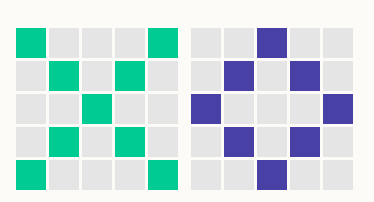
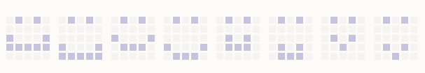
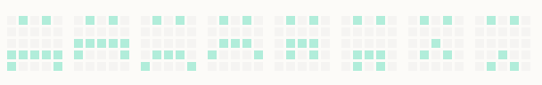

![img](data:image/svg+xml;base64,PD94bWwgdmVyc2lvbj0iMS4wIiBlbmNvZGluZz0iVVRGLTgiPz4KPHN2ZyB3aWR0aD0iOTIzcHgiIGhlaWdodD0iMjMwcHgiIHZpZXdCb3g9IjAgMCA5MjMgMjMwIiB2ZXJzaW9uPSIxLjEiIHhtbG5zPSJodHRwOi8vd3d3LnczLm9yZy8yMDAwL3N2ZyIgeG1sbnM6eGxpbms9Imh0dHA6Ly93d3cudzMub3JnLzE5OTkveGxpbmsiPgogICAgPCEtLSBHZW5lcmF0b3I6IFNrZXRjaCA0OSAoNTEwMDIpIC0gaHR0cDovL3d3dy5ib2hlbWlhbmNvZGluZy5jb20vc2tldGNoIC0tPgogICAgPHRpdGxlPkFydGJvYXJkIDIgQ29weTwvdGl0bGU+CiAgICA8ZGVzYz5DcmVhdGVkIHdpdGggU2tldGNoLjwvZGVzYz4KICAgIDxkZWZzPjwvZGVmcz4KICAgIDxnIGlkPSJBcnRib2FyZC0yLUNvcHkiIHN0cm9rZT0ibm9uZSIgc3Ryb2tlLXdpZHRoPSIxIiBmaWxsPSJub25lIiBmaWxsLXJ1bGU9ImV2ZW5vZGQiPgogICAgICAgIDxnIGlkPSJHcm91cC0yMi1Db3B5LTMiIHRyYW5zZm9ybT0idHJhbnNsYXRlKDIuMDAwMDAwLCAyNS4wMDAwMDApIj4KICAgICAgICAgICAgPGcgaWQ9Ikdyb3VwLTYiPgogICAgICAgICAgICAgICAgPGcgaWQ9Ikdyb3VwLTQiPgogICAgICAgICAgICAgICAgICAgIDxnIGlkPSJHcm91cC0xNi1Db3B5LTMiIHRyYW5zZm9ybT0idHJhbnNsYXRlKDQxLjM0MDIyNCwgMjYuMDAwMDAwKSI+CiAgICAgICAgICAgICAgICAgICAgICAgIDxwYXRoIGQ9Ik0zOTcuNDE1MiwxODYuODA1NTU2IEw0MjMuMjYyMTU2LDEyOS4wNDg0MjggTDQzMy42NTYyMTYsMTEzLjgyMjM2OCBMNDY5LjE0ODgxMSw0LjQwMzUwODc3IEw1NzUuNjg4NzA1LDEwNy43MDA1NjcgTDU4Mi43MTk1MjQsMjAuOTgyOTk1NSBMNDgyLjM1NjQ0MSw0LjQwMzUwODc3IEw0NDcuMzYzODMsOC44MzA1OTIxMSBMMzMzLjkwMTgwOSw1Ni44NzkyMDMyIEw0MjkuNzg2NzgxLDEyMC45MzA1NTYgTTUwOC43ODE5NzYsMTg2LjgwNTU1NiBMNDM3LjQ2OTc1MywxMjkuMDQ4NDI4IEw0NDIuODA0OTc3LDEyMC44ODM5NTUgTDU2OS4yNTcyNDQsMTA5LjUyMjY2MSBMNTcxLjU2NjE3MiwxMDkuNTIyNjYxIEw1NDQuMTA1OTE2LDE4Mi40MjgxOCBNNjMyLjM5MzU4MywxODIuNDI4MTggTDU3NS42ODg3MDUsMTA5LjUyMjY2MSIgaWQ9IlBhdGgtNjYiIHN0cm9rZT0iI0QwRTBFNSIgc3Ryb2tlLXdpZHRoPSI5Ij48L3BhdGg+CiAgICAgICAgICAgICAgICAgICAgICAgIDxwYXRoIGQ9Ik0zMTYuOTg5MzM0LDU5LjI4MDcwMTggTDIwMS4xNDg1MTIsNzIuNDcxODU2NyIgaWQ9IlBhdGgtOCIgc3Ryb2tlPSIjRDBFMEU1IiBzdHJva2Utd2lkdGg9IjkiPjwvcGF0aD4KICAgICAgICAgICAgICAgICAgICAgICAgPHBhdGggZD0iTTI2Ny45Mjg4NzMsMTI0Ljk2MzA4NSBMMTkyLjQwMzQ2NCw3My4yNjcxNzg0IiBpZD0iUGF0aC04IiBzdHJva2U9IiNEMEUwRTUiIHN0cm9rZS13aWR0aD0iOSI+PC9wYXRoPgogICAgICAgICAgICAgICAgICAgICAgICA8cGF0aCBkPSJNMTAwLjYzOTQ3MSwzNi4xOTc3MzM5IEwxOTIuNDAzNDY0LDczLjI2NzE3ODQiIGlkPSJQYXRoLTgiIHN0cm9rZT0iI0QwRTBFNSIgc3Ryb2tlLXdpZHRoPSI5Ij48L3BhdGg+CiAgICAgICAgICAgICAgICAgICAgICAgIDxwYXRoIGQ9Ik0yNDUuMjU4ODI5LDQuMDA1ODQ3OTUgTDE5Mi40MDM0NjQsNzMuMjY3MTc4NCIgaWQ9IlBhdGgtOCIgc3Ryb2tlPSIjRDBFMEU1IiBzdHJva2Utd2lkdGg9IjkiPjwvcGF0aD4KICAgICAgICAgICAgICAgICAgICAgICAgPHBhdGggZD0iTTI0NS4yNTg4MjksNC4wMDU4NDc5NSBMMzQwLjY1OTM0NSw2My42NTQ5NzA4IiBpZD0iUGF0aC04IiBzdHJva2U9IiNEMEUwRTUiIHN0cm9rZS13aWR0aD0iOSI+PC9wYXRoPgogICAgICAgICAgICAgICAgICAgICAgICA8cGF0aCBkPSJNMjQ1LjI1ODgyOSw0LjAwNTg0Nzk1IEwxMDQuNTQzMDY2LDMxLjg0MjEwNTMiIGlkPSJQYXRoLTgiIHN0cm9rZT0iI0QwRTBFNSIgc3Ryb2tlLXdpZHRoPSI5Ij48L3BhdGg+CiAgICAgICAgICAgICAgICAgICAgICAgIDxwYXRoIGQ9Ik05Ny4zODgwMjc2LDM3LjQwOTM1NjcgTDE2Ni41NTM0MDIsMTgxLjM2MjU3MyIgaWQ9IlBhdGgtOCIgc3Ryb2tlPSIjRDBFMEU1IiBzdHJva2Utd2lkdGg9IjkiPjwvcGF0aD4KICAgICAgICAgICAgICAgICAgICAgICAgPHBhdGggZD0iTTkyLjYxODAwMTcsMzUuMDIzMzkxOCBMMC4zOTc1MDIxNTMsMTUzLjUyNjMxNiIgaWQ9IlBhdGgtOCIgc3Ryb2tlPSIjRDBFMEU1IiBzdHJva2Utd2lkdGg9IjkiPjwvcGF0aD4KICAgICAgICAgICAgICAgICAgICAgICAgPHBhdGggZD0iTTI2Ny45Mjg4NzMsMTI0Ljk2MzA4NSBMMzMyLjMyNDIyMiw1OC45NTEzODg5IiBpZD0iUGF0aC04IiBzdHJva2U9IiNEMEUwRTUiIHN0cm9rZS13aWR0aD0iOSI+PC9wYXRoPgogICAgICAgICAgICAgICAgICAgICAgICA8cGF0aCBkPSJNMzQ5LjgxNDMxNywyMjUuOTY4OTMzIEwzMzIuMzI0MjIyLDU4Ljk1MTM4ODkiIGlkPSJQYXRoLTgiIHN0cm9rZT0iI0QwRTBFNSIgc3Ryb2tlLXdpZHRoPSI5Ij48L3BhdGg+CiAgICAgICAgICAgICAgICAgICAgICAgIDxwYXRoIGQ9Ik0yNjcuOTI4ODczLDEyNC45NjMwODUgTDE3MS43MzMzNTIsMTc2LjY1ODk5MSIgaWQ9IlBhdGgtOCIgc3Ryb2tlPSIjRDBFMEU1IiBzdHJva2Utd2lkdGg9IjkiPjwvcGF0aD4KICAgICAgICAgICAgICAgICAgICAgICAgPHBhdGggZD0iTTI3MS4xNTk3NzYsMTI2LjUgTDI2Ny45Mjg4NzMsMjE1LjYyOTc1MSIgaWQ9IlBhdGgtOCIgc3Ryb2tlPSIjRDBFMEU1IiBzdHJva2Utd2lkdGg9IjkiPjwvcGF0aD4KICAgICAgICAgICAgICAgICAgICAgICAgPHBhdGggZD0iTTU3Mi4yMzg1MSwxMDkuMTM0MzIgTDY3Ny4xODgzOTUsOTAuNDI1NjIxMyIgaWQ9IlBhdGgtMiIgc3Ryb2tlPSIjRDBFMEU1IiBzdHJva2Utd2lkdGg9IjkiPjwvcGF0aD4KICAgICAgICAgICAgICAgICAgICAgICAgPHBhdGggZD0iTTU4MS41NDU2NSwyMi4yOTgyNDU2IEw2NzcuMTg4Mzk1LDkwLjQyNTYyMTMiIGlkPSJQYXRoLTIiIHN0cm9rZT0iI0QwRTBFNSIgc3Ryb2tlLXdpZHRoPSI5Ij48L3BhdGg+CiAgICAgICAgICAgICAgICAgICAgICAgIDxwYXRoIGQ9Ik02NzYuMTUxMTYzLDgxLjk0NzM2ODQgTDY2NS44MTYxMDcsMC44MjQ1NjE0MDQiIGlkPSJQYXRoLTIiIHN0cm9rZT0iI0QwRTBFNSIgc3Ryb2tlLXdpZHRoPSI5Ij48L3BhdGg+CiAgICAgICAgICAgICAgICAgICAgICAgIDxwYXRoIGQ9Ik04MDcuMzI2ODczLDkxLjQ5MTIyODEgTDY2NS44MTYxMDcsMC44MjQ1NjE0MDQiIGlkPSJQYXRoLTIiIHN0cm9rZT0iI0QwRTBFNSIgc3Ryb2tlLXdpZHRoPSI5Ij48L3BhdGg+CiAgICAgICAgICAgICAgICAgICAgICAgIDxwYXRoIGQ9Ik04MDguOTE2ODgyLDkyLjI4NjU0OTcgTDgzOC4zMzIwNDEsMTkxLjcwMTc1NCIgaWQ9IlBhdGgtMiIgc3Ryb2tlPSIjRDBFMEU1IiBzdHJva2Utd2lkdGg9IjkiPjwvcGF0aD4KICAgICAgICAgICAgICAgICAgICAgICAgPHBhdGggZD0iTTgwOC45MTY4ODIsOTIuMjg2NTQ5NyBMNzE2LjY5NjM4MiwxNzEuMDIzMzkyIiBpZD0iUGF0aC0yIiBzdHJva2U9IiNEMEUwRTUiIHN0cm9rZS13aWR0aD0iOSI+PC9wYXRoPgogICAgICAgICAgICAgICAgICAgICAgICA8cGF0aCBkPSJNODA1LjczNjg2NSw5My4wODE4NzEzIEw2ODAuMTI2MTg0LDkwLjY5NTkwNjQiIGlkPSJQYXRoLTIiIHN0cm9rZT0iI0QwRTBFNSIgc3Ryb2tlLXdpZHRoPSI5Ij48L3BhdGg+CiAgICAgICAgICAgICAgICAgICAgICAgIDxwYXRoIGQ9Ik03MDcuMTU2MzMxLDE1MS45MzU2NzMgTDY4MC4xMjYxODQsOTAuNjk1OTA2NCIgaWQ9IlBhdGgtMiIgc3Ryb2tlPSIjRDBFMEU1IiBzdHJva2Utd2lkdGg9IjkiPjwvcGF0aD4KICAgICAgICAgICAgICAgICAgICAgICAgPGVsbGlwc2UgaWQ9Ik92YWwtNyIgZmlsbD0iIzEyNzRCRiIgY3g9IjQyNy43MTIzMTciIGN5PSIxMTkuNzI1MTQ2IiByeD0iMzcuMzY1MjAyNCIgcnk9IjM3LjM4MDExNyI+PC9lbGxpcHNlPgogICAgICAgICAgICAgICAgICAgICAgICA8ZWxsaXBzZSBpZD0iT3ZhbC03LUNvcHkiIGZpbGw9IiMxMjc0QkYiIGN4PSI3MTUuNDg5MjYyIiBjeT0iMTcxLjQzNTY3MyIgcng9IjI1LjQyNTUyMzgiIHJ5PSIyNS40MzU2NzI1Ij48L2VsbGlwc2U+CiAgICAgICAgICAgICAgICAgICAgICAgIDxlbGxpcHNlIGlkPSJPdmFsLTctQ29weS00IiBmaWxsPSIjMTI3NEJGIiBjeD0iODM5LjEyNzA0NiIgY3k9IjIwMC40NTAyOTIiIHJ4PSI0Mi41MzI3MzA0IiByeT0iNDIuNTQ5NzA3NiI+PC9lbGxpcHNlPgogICAgICAgICAgICAgICAgICAgICAgICA8ZWxsaXBzZSBpZD0iT3ZhbC03LUNvcHktMTIiIGZpbGw9IiMxMjc0QkYiIGN4PSI4MDcuMzI2ODczIiBjeT0iOTEuNDkxMjI4MSIgcng9IjIwLjI3MjYwOTgiIHJ5PSIyMC4yODA3MDE4Ij48L2VsbGlwc2U+CiAgICAgICAgICAgICAgICAgICAgICAgIDxlbGxpcHNlIGlkPSJPdmFsLTctQ29weS0yIiBmaWxsPSIjMTI3NEJGIiBjeD0iMzMzLjUwNDMwNyIgY3k9IjU4LjA4NzcxOTMiIHJ4PSIzMS40MDI2NzAxIiByeT0iMzEuNDE1MjA0NyI+PC9lbGxpcHNlPgogICAgICAgICAgICAgICAgICAgICAgICA8ZWxsaXBzZSBpZD0iT3ZhbC03LUNvcHktMyIgZmlsbD0iIzEyNzRCRiIgY3g9IjE2MC45ODgzNzIiIGN5PSIxNzcuMzg1OTY1IiByeD0iMzEuNDAyNjcwMSIgcnk9IjMxLjQxNTIwNDciPjwvZWxsaXBzZT4KICAgICAgICAgICAgICAgICAgICAgICAgPGVsbGlwc2UgaWQ9Ik92YWwtNy1Db3B5LTYiIGZpbGw9IiMxMjc0QkYiIGN4PSI1ODAuNzUwNjQ2IiBjeT0iMTkuOTEyMjgwNyIgcng9IjE2LjI5NzU4ODMiIHJ5PSIxNi4zMDQwOTM2Ij48L2VsbGlwc2U+CiAgICAgICAgICAgICAgICAgICAgICAgIDxlbGxpcHNlIGlkPSJPdmFsLTctQ29weS01IiBmaWxsPSIjMTI3NEJGIiBjeD0iNTcxLjYwODA5NiIgY3k9IjEwOS4zODU5NjUiIHJ4PSIyNi4yMzUxNDIxIiByeT0iMjYuMjQ1NjE0Ij48L2VsbGlwc2U+CiAgICAgICAgICAgICAgICAgICAgICAgIDxlbGxpcHNlIGlkPSJPdmFsLTctQ29weS0xMCIgZmlsbD0iIzEyNzRCRiIgY3g9IjY3OC45MzM2NzgiIGN5PSI5MS44ODg4ODg5IiByeD0iMjAuNjcwMTEyIiByeT0iMjAuNjc4MzYyNiI+PC9lbGxpcHNlPgogICAgICAgICAgICAgICAgICAgIDwvZz4KICAgICAgICAgICAgICAgICAgICA8ZWxsaXBzZSBpZD0iT3ZhbC03LUNvcHktNyIgZmlsbD0iIzEyNzRCRiIgY3g9IjUwOC40MDUyNTQiIGN5PSIyOC40MTUyMDQ3IiByeD0iMjguMjIyNjUyOSIgcnk9IjI4LjIzMzkxODEiPjwvZWxsaXBzZT4KICAgICAgICAgICAgICAgICAgICA8ZWxsaXBzZSBpZD0iT3ZhbC03LUNvcHktOSIgZmlsbD0iIzEyNzRCRiIgY3g9IjcwOC43NDYzMzkiIGN5PSIyOC40MTUyMDQ3IiByeD0iMjguMjIyNjUyOSIgcnk9IjI4LjIzMzkxODEiPjwvZWxsaXBzZT4KICAgICAgICAgICAgICAgICAgICA8ZWxsaXBzZSBpZD0iT3ZhbC03LUNvcHktOCIgZmlsbD0iIzEyNzRCRiIgY3g9IjIzMy43MzEyNjYiIGN5PSI5OC44MDExNjk2IiByeD0iMjMuODUwMTI5MiIgcnk9IjIzLjg1OTY0OTEiPjwvZWxsaXBzZT4KICAgICAgICAgICAgICAgICAgICA8ZWxsaXBzZSBpZD0iT3ZhbC03LUNvcHktMjAiIGZpbGw9IiMxMjc0QkYiIGN4PSIyODQuNjExNTQyIiBjeT0iMjkuNjA4MTg3MSIgcng9IjE1LjEwNTA4MTgiIHJ5PSIxNS4xMTExMTExIj48L2VsbGlwc2U+CiAgICAgICAgICAgICAgICAgICAgPGVsbGlwc2UgaWQ9Ik92YWwtNy1Db3B5LTE4IiBmaWxsPSIjMTI3NEJGIiBjeD0iMTM4LjcyODI1MiIgY3k9IjU5LjQzMjc0ODUiIHJ4PSIzMS40MDI2NzAxIiByeT0iMzEuNDE1MjA0NyI+PC9lbGxpcHNlPgogICAgICAgICAgICAgICAgICAgIDxlbGxpcHNlIGlkPSJPdmFsLTctQ29weS0xOSIgZmlsbD0iIzEyNzRCRiIgY3g9IjM2Ljk2NzcwMDMiIGN5PSIxODYuNjg0MjExIiByeD0iMzYuOTY3NzAwMyIgcnk9IjM2Ljk4MjQ1NjEiPjwvZWxsaXBzZT4KICAgICAgICAgICAgICAgICAgICA8ZWxsaXBzZSBpZD0iT3ZhbC03LUNvcHktMTEiIGZpbGw9IiMxMjc0QkYiIGN4PSIzMTEuNjQxNjg4IiBjeT0iMTUyLjA4NzcxOSIgcng9IjIyLjMyMTcwNTQiIHJ5PSIyMi4zMzA2MTUzIj48L2VsbGlwc2U+CiAgICAgICAgICAgICAgICA8L2c+CiAgICAgICAgICAgIDwvZz4KICAgICAgICA8L2c+CiAgICA8L2c+Cjwvc3ZnPg==)

## II .Yapay sinir ağları nasıl kurulur?

### Daha önce de söylediğimiz gibi, nöronlar çok basit işlem birimleridir. Bölüm 4'teki doğrusal ve lojistik gerilemeyi tartıştıktan sonra, sinir ağlarının temel teknik detayları aynı fikrin küçük farklılıkları olarak görülebilir.

> Not
>
> ## Ağırlıklar ve girdiler
>
> Temel yapay nöron modeli, doğrusal ve lojistik regresyonda olduğu gibi ağırlıklar olarak adlandırılan bir dizi uyarlamalı parametre içerir. Tıpkı regresyonda olduğu gibi, bu ağırlıklar eklenen nöronun girişlerinde çarpanlar olarak kullanılır. Girişlerin ağırlıklarının toplamı girişlerin doğrusal birleşimi olarak adlandırılır. Muhtemelen alışveriş faturası benzetmesini hatırlayabilirsiniz: her bir ürünün miktarını birim fiyatıyla çarparak toplamı elde etmek için eklersiniz.
>

Altı girişli (altı alışveriş ürününün miktarına benzer: patatesler, havuçlar vb.), Giriş1, giriş2, giriş3, giriş4, giriş5 ve giriş6 gibi bir nöronumuz varsa, altı ağırlığa da ihtiyacımız var. Ağırlıklar, ürünlerin fiyatlarına benzer. Onlara kilo1, ağırlık2, ağırlık3, ağırlık4, ağırlık5 ve ağırlık6 diyeceğiz. Ek olarak, genellikle doğrusal regresyonda yaptığımız gibi bir kesişme terimi de dahil etmek isteriz. Bu, örneğin bir kredi kartı ödemesinin işlenmesi nedeniyle sabit bir ek ücret olarak düşünülebilir.

Daha sonra şu gibi lineer kombinasyonu hesaplayabiliriz: linear kombinasyonu = kesişme + ağırlık1 × giriş1 + ... + ağırlık6 × giriş6 (..., toplamın 1'den 6'ya kadar olan tüm terimleri içerdiği anlamına gelen kısa bir gösterimdir).

Bazı örnek sayılarla daha sonra alabiliriz:

10,0 + 5,4 × 8 + (-10,2) × 5 + (-0,1) × 22 + 101,4 × (-5) + 0,0 × 2 + 12,0 × (-3) = -543,0

------

### Alıştırmalar için ilgili sayfaya gidebilirsiniz.

https://course.elementsofai.com/5/2

------

Ağırlıklar neredeyse her zaman, daha önce tartışıldığı gibi doğrusal veya lojistik regresyondaki fikirleri kullanarak aynı fikirlerden öğrenilir. Fakat bunu daha ayrıntılı olarak tartışmadan önce, bir nöronun bir çıkış sinyali göndermeden önce tamamladığı bir başka önemli aşamayı tanıtırız.

### Aktivasyonlar ve çıkışlar

Doğrusal kombinasyon hesaplandıktan sonra, nöron bir işlem daha yapar. Doğrusal kombinasyonu alır ve bunu aktivasyon fonksiyonu denilen bir hale getirir. Aktivasyon fonksiyonunun tipik örnekleri:

- identity işlevi: hiçbir şey yapmayan ve sadece doğrusal birleşimi çıktılayan
- adım işlevi: Doğrusal kombinasyonun değeri sıfırdan büyükse, bir puls (ON) gönderin, aksi halde hiçbir şey yapmayın (OFF).
- sigmoid işlevi: adım işlevinin “yumuşak” bir sürümü

İlk etkinleştirme işlevi olan kimlik işlevinde nöronun doğrusal regresyonla tamamen aynı olduğunu unutmayın. Kimlik fonksiyonunun sinir ağlarında nadiren kullanılmasının nedeni budur: yeni ve ilginç bir şey olmaz.

> Not
>
> ## Nöronlar nasıl aktive edilir
>
> Gerçek biyolojik nöronlar, “çiviler” adı verilen keskin, elektriksel darbeler göndererek iletişim kurar, böylece herhangi bir zamanda, giden sinyalleri açık veya kapalı olur (1 veya 0). Adım işlevi bu davranışı taklit eder. Bununla birlikte, yapay sinir ağları, ikinci tür aktivasyon fonksiyonlarını kullanma eğilimindedir, böylece her zaman sürekli bir sayısal aktivasyon seviyesi üretirler. Bu nedenle, biraz garip bir konuşma şekli kullanmak için, gerçek nöronlar Mors koduna benzer bir şeyle iletişim kurar, oysa yapay nöronlar seslerinin perdesini ses çıkarıyormuş gibi ayarlayarak iletişim kurar.
>

![carstop](data:image/svg+xml;base64,PHN2ZyBpZD0iTGF5ZXJfMSIgeG1sbnM9Imh0dHA6Ly93d3cudzMub3JnLzIwMDAvc3ZnIiB2aWV3Qm94PSIwIDAgNjkxLjMgNDI4Ij4KICAgIDxzdHlsZT4KICAgICAgICAuc3Qwe29wYWNpdHk6LjV9LnN0MXtmaWxsOiMzNDJkNzF9LnN0MntmaWxsOiMzYjNiNzV9LnN0M3tmaWxsOiMwYjAxNDZ9LnN0NHtmaWxsOiNlOWU4ZjB9LnN0NXtmaWxsOiM5NGE3Y2F9LnN0NntmaWxsOiNlZmYwZjR9LnN0N3tmaWxsOiNmZmMwN2Z9LnN0OHtmaWxsOiNjMGMwZDh9LnN0OXtmaWxsOiM0MDQwNjB9LnN0MTB7ZmlsbDojZDBkMGRkfS5zdDExe2ZpbGw6I2ZmM2U1N30uc3QxMntmaWxsOiNmZmZ9LnN0MTN7ZmlsbDojZTllOWVkfS5zdDE0e29wYWNpdHk6LjF9LnN0MTV7ZmlsbDojNDc0N2ExfQogICAgPC9zdHlsZT4KICAgIDx0aXRsZT4KICAgICAgICBBcnRib2FyZCAxCiAgICA8L3RpdGxlPgogICAgPGcgY2xhc3M9InN0MCI+CiAgICAgICAgPHBhdGggY2xhc3M9InN0MSIgZD0iTTQwNi44IDMzOS4zYzAgLjkuNyAxLjcgMS43IDEuN2gyMTEuM2MuOSAwIDEuNy0uNyAxLjctMS43IDAtMi45LTIuMy01LjItNS4yLTUuMkg0MTIuMWMtMi45LS4xLTUuMyAyLjMtNS4zIDUuMnoiLz4KICAgIDwvZz4KICAgIDxnIGNsYXNzPSJzdDAiPgogICAgICAgIDxwYXRoIGNsYXNzPSJzdDEiIGQ9Ik0zOTMgMzcxLjhjLTE5My45IDIzLjgtMjIzLjUgMjYuNS0zNjIuNCAxNi41LTEyLjEtLjktMjUuNC01LjMtMjguMS0xMS43LTEuOS00LjMgMS45LTExLjEgOS0xMy40czE1LjUtMi45IDIzLjctMy41YzEwNC4yLTcuMyAyMDkuNy05LjcgMzEzLjktMi41IDExLjMuOCAyMyAxLjggMzIuNyA1czE1LjctLjIgMTQgNS44bC0yLjggMy44Ii8+CiAgICA8L2c+CiAgICA8cGF0aCBjbGFzcz0ic3QyIiBkPSJNMzEyLjEgMjc5LjRsLTE0MS43IDYuMSAzMC44IDc5LjEgNDkuNy4xIDE3LTIuM3oiLz4KICAgIDxwYXRoIGNsYXNzPSJzdDMiIGQ9Ik0yMzIuMyAzMDMuMWMtLjggMC0xLjYuMS0yLjMuMi00LjMuMS0xMS4yLjItMTMuOS4ySDIxNWMtMTUuOC4zLTI5LjIgMTguOS0zMCA0My4yLS44IDI0LjQgMTAuOCA0My41IDI2LjYgNDQgMCAwIDE2LjkuNSAyMC45LjZoMS42YzE1LjgtLjMgMjguMi0yMC4zIDI3LjctNDQuNy0uNS0yNC4zLTEzLjctNDMuOC0yOS41LTQzLjV6bTE4LjIgNDMuOGMuMyAxNC44LTcuMiAyNi45LTE2LjggMjcuMWgtMWMtOS4yLS42LTE2LjYtMTIuMS0xNi45LTI2LjQtLjItMTEuOCA0LjUtMjEuOSAxMS4yLTI1LjYgMS4zLS43IDIuNy0xLjIgNC4xLTEuNC41LS4xLjktLjEgMS40LS4xIDkuNy0uMiAxNy43IDExLjYgMTggMjYuNHoiLz4KICAgIDxwYXRoIGNsYXNzPSJzdDQiIGQ9Ik0yMzIuNiAzMjAuNWMtLjUgMC0xIC4xLTEuNC4xLTEuNC4yLTIuOC43LTQuMSAxLjQtNi44IDMuNy0xMS41IDEzLjgtMTEuMiAyNS42LjMgMTQuMyA3LjggMjUuOCAxNi45IDI2LjRoMWM5LjYtLjIgMTcuMS0xMi4zIDE2LjgtMjcuMS0uNC0xNC44LTguNC0yNi42LTE4LTI2LjR6Ii8+CiAgICA8cGF0aCBjbGFzcz0ic3Q1IiBkPSJNNDYuMSAyOTYuMmMuOCAwIDIxLjEtLjkgMjEuMS0uOWw3LjUgMTEuOS0xMi40IDE1LjYtMTcuNS01LjggMS4zLTIwLjh6Ii8+CiAgICA8cGF0aCBjbGFzcz0ic3QzIiBkPSJNMzkuOSAzMzQuMWMyLjItMjQuMyAxNi43LTQyLjggMzIuNC00MS40IDIuOS4zIDUuNiAxLjIgOC4xIDIuNi0xMS41IDUuNS0yMC4yIDIxLjctMjAuOSA0MS0uOSAyMy41IDEwLjQgNDMuMiAyNS40IDQ1LTQtLjMtMjAuOS0xLjgtMjAuOS0xLjgtMTUuOC0xLjMtMjYuMy0yMS4xLTI0LjEtNDUuNHoiLz4KICAgIDxwYXRoIGNsYXNzPSJzdDMiIGQ9Ik01Ny44IDMzNi4yYy43LTE5LjQgOS40LTM1LjUgMjAuOS00MSAyLjktMS40IDYuMS0yLjEgOS4zLTIgMTUuOC42IDI3LjggMjAuOCAyNi45IDQ1LjItLjkgMjQuNC0xNC40IDQzLjYtMzAuMiA0My4xLS41IDAtMS4xLS4xLTEuNi0uMS0xNC45LTItMjYuMS0yMS43LTI1LjMtNDUuMnoiLz4KICAgIDxwYXRoIGNsYXNzPSJzdDIiIGQ9Ik00MjAuOCAzMTcuMWwtOS45LTQ1LjItOTUuMSAzLjEgMy43IDg0LjcgNDQuMy0zLjIgNTMuNS0xNS43eiIvPgogICAgPHBhdGggY2xhc3M9InN0MyIgZD0iTTM4OS4zIDI4My44Yy0zIDAtNS44LjctOC41IDItMi43LTEuNi01LjctMi41LTguOC0yLjctMTUuOC0uOS0yOS42IDE4LjItMzEgNDIuNS0xLjMgMjQuMyA5LjggNDUuNyAyNS42IDQ2LjUuMSAwLS4xIDAgMCAwIDMuMi4zIDEyLjgtLjEgMTcuOS4xLjcuMSAzLjgtLjEgNC42LS4xIDE1LjggMCAyOC43LTE5LjcgMjguNy00NC4xLjEtMjQuMy0xMi43LTQ0LjEtMjguNS00NC4yeiIvPgogICAgPHBhdGggY2xhc3M9InN0NCIgZD0iTTM3NS40IDMyNy45YzAtMTAuMiA0LjMtMTguOSAxMC4zLTIyIDEuMi0uNiAyLjQtMSAzLjYtMS4yLjQtLjEuOC0uMSAxLjItLjEgOC4zIDAgMTUuMSAxMC41IDE1IDIzLjMgMCAxMi45LTYuOCAyMy4zLTE1LjIgMjMuM2gtLjhjLTcuOS0uNy0xNC4yLTEwLjktMTQuMS0yMy4zeiIvPgogICAgPHBhdGggY2xhc3M9InN0NiIgZD0iTTQ3LjQgMjIyLjVjMTEuMi0yNy4zIDIyLTk3LjYgMjI2LjgtODEuNiAwIDAgNzQuMyA1LjQgMTE4IDg3czI2LjUgMTExLjMgMjYuNSAxMTEuMy0uMy42LTEuMyAxLjVjMS4yLTE2LjUgMi41LTYyLjUtMTguOS02NC4xLTIxLjYtMS42LTMxLjIgNTQuOS0zMy44IDc0LjItLjUgMy40LTMuMSA2LTYuNSA2LjQtMTUuNCAyLTM0LjggMy42LTU5IDQuNy0xMy44LjYtMjYuOCAxLjMtMzkuMSAyIDMuMS02LjYgMTAuNy0yNy40LjUtNTIuMi0xMS45LTI4LjctMzMuNS0yMi44LTMzLjUtMjIuOHMtMjAuMSAzLjQtMzMuMiA1Ny40Yy0xLjEgNC41LTIuNSA4LjUtNC4xIDEyLTMuMiA3LjEtMTAuNCAxMS42LTE4LjIgMTEuMi00Ni42LTIuMS04My45LTEuNy0xMjQuNC00LjgtNTYuNS00LjItMTEuMy0xMTQuMS4yLTE0Mi4yeiIvPgogICAgPHBhdGggY2xhc3M9InN0NyIgZD0iTTE4My4yIDIwNi45Yy04LjIgMC0xNC45IDYuNy0xNC45IDE0Ljl2MThoMTQuM2M3LjEgMCAxMy4yLTUgMTQuNi0xMmwuNi0zLjFjMS44LTkuMy01LjMtMTcuOC0xNC42LTE3Ljh6Ii8+CiAgICA8cGF0aCBjbGFzcz0ic3Q3IiBkPSJNMTgyLjYgMjQwLjFoLTE0Ljd2LTE4LjRjMC04LjQgNi45LTE1LjMgMTUuMy0xNS4zIDQuNiAwIDguOSAyIDExLjggNS42IDIuOSAzLjUgNC4xIDguMiAzLjIgMTIuN2wtLjYgMy4xYy0xLjQgNy4xLTcuNyAxMi4zLTE1IDEyLjN6bS0xMy45LS44aDEzLjhjNi45IDAgMTIuOS00LjkgMTQuMi0xMS43bC42LTMuMWMuOC00LjItLjMtOC42LTMtMTEuOS0yLjgtMy4zLTYuOC01LjMtMTEuMS01LjMtOCAwLTE0LjQgNi41LTE0LjQgMTQuNHYxNy42aC0uMXoiLz4KICAgIDxwYXRoIGNsYXNzPSJzdDgiIGQ9Ik0yNDQuNiAyMzMuN2MtMS43LTYuMS0zLjEtMTEuNS0zLjktMTUuNS0zLjktMjEuMy04LjktNDguNiAxMi40LTUzLjdzNTYuNi05LjYgNzMuMSAxNy41YzE2LjIgMjYuNiAyMC41IDQ1LjkgMjAuNSA0NS45cy4zLjkuNyAyLjVNMTY4LjMgMjM5LjdjMy45IDAgNy4zLTIuOCA4LjEtNi42IDEzLjktNjkuNyAxMC42LTY1LjktNTguNS02NS4zLTQxLjMuNC01NC41IDM1LjUtNTkuMSA0Ni41LTEuNyA0LjEtNC41IDEwLjktNy4zIDE5LTEgMi43IDEuMSA1LjYgNCA1LjZsMTEyLjguOHoiLz4KICAgIDxwYXRoIGNsYXNzPSJzdDEwIiBkPSJNNjE5LjQgMTI2LjJoLTMuM2MtMiAwLTMuNiAxLjYtMy42IDMuNnYyMDcuNGMwIDIgMS42IDMuNiAzLjYgMy42aDMuM2MyIDAgMy42LTEuNiAzLjYtMy42VjEyOS44YzAtMi0xLjYtMy42LTMuNi0zLjZ6Ii8+CiAgICA8cGF0aCBjbGFzcz0ic3QxMSIgZD0iTTYzNi42IDMuNUg1OTljLTExLjQgMC0yMS45IDYuMS0yNy42IDE1LjlsLTE4LjggMzIuNWMtNS43IDkuOS01LjcgMjIgMCAzMS44bDE4LjggMzIuNWM1LjcgOS45IDE2LjIgMTUuOSAyNy42IDE1LjloMzcuNmMxMS40IDAgMjEuOS02LjEgMjcuNi0xNS45TDY4MyA4My43YzUuNy05LjkgNS43LTIyIDAtMzEuOGwtMTguOC0zMi41QzY1OC41IDkuNiA2NDggMy41IDYzNi42IDMuNXoiLz4KICAgIDxwYXRoIGNsYXNzPSJzdDYiIGQ9Ik02MzkgMTM1LjdoLTQyLjNjLTExLjEgMC0yMS41LTYtMjctMTUuNmwtMjEuMi0zNi43Yy01LjYtOS42LTUuNi0yMS42IDAtMzEuMmwyMS4yLTM2LjdDNTc1LjIgNiA1ODUuNSAwIDU5Ni42IDBINjM5YzExLjEgMCAyMS41IDYgMjcgMTUuNmwyMS4yIDM2LjdjNS42IDkuNiA1LjYgMjEuNiAwIDMxLjJMNjY2IDEyMC4xYy01LjYgOS43LTE1LjkgMTUuNi0yNyAxNS42ek01OTYuNiA3Yy04LjYgMC0xNi43IDQuNi0yMSAxMi4xbC0yMS4yIDM2LjdjLTQuMyA3LjUtNC4zIDE2LjcgMCAyNC4ybDIxLjIgMzYuN2M0LjMgNy41IDEyLjMgMTIuMSAyMSAxMi4xSDYzOWM4LjYgMCAxNi43LTQuNiAyMS0xMi4xTDY4MS4xIDgwYzQuMy03LjUgNC4zLTE2LjcgMC0yNC4ybC0yMS4yLTM2LjdDNjU1LjYgMTEuNiA2NDcuNiA3IDYzOSA3aC00Mi40eiIvPgogICAgPGc+CiAgICAgICAgPHBhdGggY2xhc3M9InN0MTIiIGQ9Ik01NzguOCA3Mi4yYzAgMy42IDEuNSA1LjcgMy42IDUuNyAxLjcgMCAzLTEuNiAzLTMuOSAwLTIuNy0xLjYtMy42LTMuNS00LjYtNC4yLTIuMi03LjctNC4yLTcuNy0xMC45IDAtNi4xIDMuOC05LjMgOC05LjMgNS40IDAgOC4xIDQuOSA4LjEgMTAuNkg1ODVjMC0yLjktMS00LjgtMi44LTQuOC0xLjUgMC0yLjggMS4xLTIuOCAzLjQgMCAyLjIgMS4zIDMuNCAzLjMgNC40IDMuNyAxLjkgOCA0LjEgOCAxMC43IDAgNi44LTMuNSAxMC42LTguNiAxMC42LTQuOSAwLTguNi00LjMtOC42LTExLjhsNS4zLS4xek01OTkuNCA1Ni43aC01LjFWNTBoMTUuNnY2LjZoLTUuMnYyNi41aC01LjNWNTYuN3pNNjEyLjggNjYuNmMwLTkuMSA0LjUtMTcuNCAxMi4xLTE3LjRzMTIgOC4zIDEyIDE3LjQtNC41IDE3LjQtMTIgMTcuNGMtNy42LjEtMTIuMS04LjMtMTIuMS0xNy40em0xOC43IDBjMC01LjQtMi41LTEwLjUtNi43LTEwLjVzLTYuNyA1LjEtNi43IDEwLjUgMi41IDEwLjUgNi43IDEwLjUgNi43LTUgNi43LTEwLjV6TTY0My4xIDUwaDkuNWM1IDAgOC4zIDUuNSA4LjMgMTIgMCA2LjQtMy4zIDEyLTguMyAxMmgtNC4zdjkuMkg2NDNsLjEtMzMuMnptMTIuNSAxMmMwLTMuMS0xLjQtNS43LTMuNi01LjdoLTMuNnYxMS41aDMuNmMyLjIgMCAzLjYtMi43IDMuNi01Ljh6Ii8+CiAgICA8L2c+CiAgICA8Zz4KICAgICAgICA8cGF0aCBjbGFzcz0ic3QyIiBkPSJNMjQ0LjYgMjMzLjdsMTAyLjktMy4zYy0uNS0xLjYtLjctMi41LS43LTIuNXMtLjEtLjMtLjItLjljLTggLjEtNzIuMS0yLTEwNC41LTMuMS42IDMgMS41IDYuMyAyLjUgOS44eiIvPgogICAgPC9nPgogICAgPGc+CiAgICAgICAgPHBhdGggY2xhc3M9InN0MyIgZD0iTTI3MC44IDI1OS4yYy0xMC40IDAtMTguOC04LjQtMTguOC0xOC44di03LjVjMC0xMC40IDguNC0xOC44IDE4LjgtMTguOHMxOC44IDguNCAxOC44IDE4Ljh2Ny41YzAgMTAuMy04LjQgMTguOC0xOC44IDE4Ljh6bTAtNDEuN2MtOC41IDAtMTUuMyA2LjktMTUuMyAxNS4zdjcuNWMwIDguNSA2LjkgMTUuMyAxNS4zIDE1LjMgOC41IDAgMTUuMy02LjkgMTUuMy0xNS4zdi03LjVjMC04LjQtNi44LTE1LjMtMTUuMy0xNS4zeiIvPgogICAgPC9nPgogICAgPGc+CiAgICAgICAgPHBhdGggY2xhc3M9InN0MTMiIGQ9Ik0zNDcuMyAyMjkuOWwtMTAyLjcgMy4zYzcuMyAyNS42IDIxLjggNjUuMiAyOC42IDgxLjQgNyAxNi43IDE1LjUgMjMuMiA0Ny4yIDIwLjUgMzAuNS0yLjYgMzAuNi0xMy41IDMyLjktMjkuNiA0LjMtMzAtMi45LTY1LjEtNi03NS42eiIvPgogICAgPC9nPgogICAgPGcgY2xhc3M9InN0MTQiPgogICAgICAgIDxwYXRoIGNsYXNzPSJzdDE1IiBkPSJNMzA4LjEgMzM2LjVjLTIyLjQgMC0yOS42LTcuMi0zNS43LTIxLjYtNi44LTE2LjEtMjEuMy01NS45LTI4LjctODEuNS0uMS0uNS4xLS45LjYtMS4xLjUtLjEuOS4xIDEuMS42IDcuMyAyNS41IDIxLjggNjUuMiAyOC42IDgxLjMgNi44IDE2LjMgMTQuOCAyMi42IDQ2LjMgMTkuOSAyOC40LTIuNCAyOS44LTEyIDMxLjgtMjYuNi4xLS43LjItMS41LjMtMi4yIDQuMy0yOS44LTIuOC02NC41LTYtNzUuMy0uMS0uNS4xLS45LjYtMS4xLjUtLjEuOS4xIDEuMS42IDMuMSAxMC45IDEwLjMgNDUuOSA2IDc2LS4xLjgtLjIgMS41LS4zIDIuMi0yLjEgMTQuOC0zLjYgMjUuNi0zMy40IDI4LjEtNC41LjUtOC42LjctMTIuMy43eiIvPgogICAgPC9nPgo8L3N2Zz4K)

Lineer kombinasyon ve aktivasyon fonksiyonu tarafından belirlenen nöronun çıkışı, bir tahmin veya karar almak için kullanılabilir. Örneğin, ağ, kendi kendini süren bir arabanın önündeki bir durma işaretini tanımlamak için tasarlandıysa, giriş, arabanın önüne tutturulmuş bir kamera tarafından yakalanan bir görüntünün pikselleri olabilir ve çıkış, işaretten önce arabayı durduran bir durdurma prosedürü etkinleştirmek için kullanılabilir.

Ağda öğrenme veya uyarlama, ağların doğru çıktıları üretmesini sağlayacak şekilde, aynı doğrusal veya lojistik regresyonda olduğu gibi ağırlıklar ayarlandığında gerçekleşir. Birçok sinir ağı çok büyüktür ve en büyüğü yüz milyarlarca ağırlık içerir. Hepsini optimize etmek, büyük miktarda hesaplama gücü gerektiren göz korkutucu bir görev olabilir.

------

### Alıştırmalar için ilgili sayfaya gidebilirsiniz.

https://course.elementsofai.com/5/2

------

### Perceptron: Bütün YSA'ların annesi (YSA:Yapay Sinir Ağları)

Perceptron, yukarıda bahsettiğimiz adım etkinleştirme işlevine sahip basit nöron modeli için süslü bir isimdir. Sinirsel hesaplamanın ilk resmi modellerinden biriydi ve sinir ağları tarihindeki temel rolü nedeniyle onu “yapay sinir ağlarının anası” olarak adlandırmak haksızlık olmazdı.

İkili sınıflandırma görevlerinde basit bir sınıflandırıcı olarak kullanılabilir. Perceptron algoritması olarak adlandırılan veriden Perceptron algoritması denilen ağırlıkları öğrenmeye yönelik bir yöntem 1957 yılında psikolog Frank Rosenblatt tarafından tanıtıldı. Perceptron algoritmasını ayrıntılı olarak incelemeyeceğiz. En yakın komşu sınıflandırıcı kadar basit olduğunu söylemek yeterli. Temel ilke, ağ eğitim verilerini her seferinde bir örnek olarak beslemektir. Her bir yanlış sınıflandırma, ağırlıkta bir güncellemeye yol açar.

Not

> ## AI abartısı
>
> Keşfedilmesinden sonra, Perceptron algoritması, mucit Frank Rosenblatt tarafından yapılan iyimser ifadelerden ötürü çok dikkat çekti. AI hyperbole klasik bir örneği, 8 Temmuz 1958'de yayınlanan New York Times makalesidir: 
> “Donanma, bugün yürüyebileceği, konuşabileceği, görebileceği, tekrar üretebileceği ve varoluşunun farkında olabileceğini umduğu bir elektronik bilgisayarın embriyosunu ortaya çıkardı. ” 
>
> Lütfen dikkat edin sinir ağları meraklıları, iyimserliğe yatkın olanların hepsi değil. AI'ya yönelik mantık temelli uzman sistemler yaklaşımının yükselişi ve düşüşü AI-hype'ın aynı özelliklerine sahipti ve insanlar nihai atılımın sadece kısa bir süre sonra olduğunu iddia ettiler. Hem 1960'ların başlarında hem de 1980'lerin sonunda ortaya çıkan sonuç AI Winter denilen araştırma fonunda bir çöküş oldu.
>

Sonunda 1960'larda sinir ağı yaklaşımının yirmi yıldan fazla bir süredir vazgeçilmesinin neredeyse tamamen bitmesine yol açan tartışmaların geçmişi son derece etkileyicidir. Makale *A Sociological Study of the Official History of the Perceptrons Controversy*  yayınlanan Mikel Olazaran tarafından ( *Science Sosyal Bilgiler*, 1996) olayları bilim sosyolojisi açısından inceler. Bugün okumak oldukça düşündürücüdür. Yakında insan zekası seviyesine ulaşacak ve kendini bilinçlendirecek sinir ağları algoritmaları geliştirmiş olan ünlü AI kahramanlarıyla ilgili hikayeler okumak, şu anki yutturma sırasında yapılan bazı ifadelerle karşılaştırılabilir. Yukarıdaki makaleye bakarsanız, hepsini okumamış olsanız bile, bugünün haberleri için ilginç bir arka plan sağlayacaktır. Örneğin [MIT Teknoloji İncelemesinde](https://www.technologyreview.com/s/608911/is-ai-riding-a-one-trick-pony/) bir [makale](https://www.technologyreview.com/s/608911/is-ai-riding-a-one-trick-pony/) düşününEylül 2017'de yayınlanan ve AI için milyonlarca dolarlık bir Vector Vector enstitüsünün kurucu ortağı olan Jordan Jacobs, 1980'lerde sinir ağı algoritmalarının geliştirilmesine katkılarından dolayı Geoffrey Hinton'u (şu anki derin öğrenme patlamasının figür başkanı) Einstein'la karşılaştırdı. ve sonra. Ayrıca önceki bölümde belirtilen İnsan Beyni projesini de hatırlayın.

Hinton'a göre, “çalışmadığı gerçeği sadece geçici bir sıkıntıdır” (makaleye göre, Hinton yukarıdaki ifade hakkında gülüyor olsa da, onunla ilgili ne kadar ciddi olduğunu söylemek zordur). İnsan beyni projesi [“bilinç anlayışımızda derin bir sıçramaya yakın” olduğunu](https://www.humanbrainproject.eu/en/follow-hbp/news/the-quest-for-consciousness/) iddia ediyor . Bu tanıdık gelmiyor mu?

Hiç kimse geleceği kesin olarak bilemez, ancak yakınlardaki gelişmelere ilişkin daha önceki duyuruların kayıtlarını bilerek, bazı eleştirel düşünceler önerilir. Son bölümde AI'nın geleceğine döneceğiz, ancak şimdilik yapay sinir ağlarının nasıl kurulduğunu görelim.

### Nöronları bir araya getirmek: Ağlar

Tek bir nöron, gerçek yaşam uygulamalarının çoğunda güvenilir kararlar ve tahminler almak için çok basit olacaktır. Sinir ağlarının tüm potansiyelini açığa çıkarmak için, bir nöronun çıktısını, başka nöronların çıktısı gibi diğer nöronların girdisi olarak kullanabiliriz. Tüm ağın çıktısı, çıkış katmanı olarak adlandırılan belirli bir nöron alt kümesinin çıktısı olarak elde edilir. Buna, sinir ağlarının parametrelerini verilerden öğrenerek farklı davranışlar üretmeye adapte olma şeklini tartıştıktan sonra, bir miktar geri döneceğiz.

> Anahtar terminoloji
>
> ## Katmanlar
>
> Genellikle ağ mimarisi katmanlardan oluşur. Giriş katmanı, girişlerini doğrudan veriden alan nöronlardan oluşur. Örneğin, bir görüntü tanıma görevinde, giriş katmanı, giriş görüntüsünün piksel değerlerini giriş katmanının girişleri olarak kullanır. Ağ tipik olarak diğer nöronların çıktılarını girdi olarak kullanan ve çıktılarını diğer nöron tabakalarına girdi olarak kullanılan gizli katmanlara da sahiptir. Son olarak, çıktı katmanı tüm ağın çıktısını üretir. Belirli bir katmandaki tüm nöronlar önceki katmandaki nöronlardan girdi alır ve çıktılarını bir sonrakine besler.
>

Çok katmanlı bir ağın klasik bir örneği, çok katmanlı algılayıcı olarak adlandırılır. Yukarıda tartıştığımız gibi, Rosenblatt'ın Perceptron algoritması, bir Perceptronın ağırlıklarını öğrenmek için kullanılabilir. Çok katmanlı algılayıcı için, ilgili öğrenme problemi çok daha zor ve çalışan bir çözüm keşfedilmesi uzun zaman aldı. Fakat nihayetinde bir kişi tarafından icat edildi: geri yayılım algoritması 1980'lerin sonunda sinir ağlarının canlanmasına yol açtı. Hala en gelişmiş derin öğrenme çözümlerinin kalbinde yer almaktadır.

> Not
>
> ## Bu arada Helsinki'de ...
>
> Geri yayılım algoritmasına giden yollar oldukça uzun ve dolambaçlıdır. Tarihin ilginç bir kısmı, Helsinki Üniversitesi bilgisayar bilimleri bölümü ile ilgilidir. Bölümün 1967'de kurulmasından yaklaşık üç yıl sonra, Seppo Linnainmaa adlı bir öğrenci tarafından bir [yüksek lisans tezi](http://people.idsia.ch/~juergen/linnainmaa1970thesis.pdf) hazırlandı. Tezin konusu, “Bireysel yuvarlama hatalarına Taylor yaklaşımı ile algoritmaların kümülatif yuvarlama hatası” (“Cumulative rounding error of algorithms as a Taylor approximation of individual rounding errors” ) idi (tez, Fince olarak yazılmıştır, bu yüzden asıl başlık olan “Algoritmin kumulatiivinen pyöristysvirhe yksittäisten pyöristysvirheiden Taylor-kehitelmänä”).
>
> Tezde geliştirilen otomatik farklılaşma yöntemi daha sonra diğer araştırmacılar tarafından, çok tabakalı bir sinir ağının çıktısının, geri yayılmadaki ana fikir olan bireysel ağırlıklara göre hassasiyetini ölçmek için uygulanmıştır.
>

### Basit bir sinir ağı sınıflandırıcısı

Bir sinir ağı sınıflandırıcı kullanmanın nispeten basit bir örneğini vermek için, MNIST basamak tanıma görevine çok benzeyen, yani görüntüleri iki sınıfta sınıflandıran bir görev düşüneceğiz. Öncelikle, bir görüntünün bir çarpı işareti (x) veya daire (o) gösterip göstermediğini sınıflandırmak için bir sınıflandırıcı oluşturacağız. Resimlerimiz burada renkli veya beyaz pikseller olarak temsil edilir ve pikseller 5x5 ızgarada düzenlenir. Bu formatta haç ve çember (daha çok elmas gibi, dürüst olmak üzere) resimlerimiz şuna benzer:

Bir sinir ağı sınıflandırıcısı oluşturmak için, problemi öğrendiğimiz yöntemleri kullanarak çözebileceğimiz bir şekilde resmileştirmeliyiz. İlk adımımız, piksellerdeki bilgiyi bir sınıflandırıcıya girdi olarak kullanılabilecek sayısal değerlerle temsil etmektir. Kare renkliyse 1, beyaz ise 0 kullanın. Yukarıdaki grafikteki sembollerin farklı renkte olmasına rağmen (yeşil ve mavi), sınıflandırıcımızın renk bilgisini görmezden geleceğini ve sadece renkli / beyaz bilgileri kullanacağını unutmayın. Görüntüdeki 25 piksel, sınıflandırıcı girdilerimizi oluşturur.

Sayısal gösterimde hangi pikselin hangisi olduğunu bildiğimizden emin olmak için, pikselleri metin okuduğunuzla aynı sırada listelemeye karar verebiliriz, bu nedenle en baştan satır satır satır sıraya ve her satır soldan sağa okunur. Örneğin haçtaki ilk satır 1,0,0,0,1; ikinci sıra 0,1,0,1,0 ve benzeri olarak. Çapraz giriş için tam giriş: 1.0,0,0,1,0,1,0,1,0,0,0,1,0,0,0,1,0,1,0, 1,0,0,0,1.

İlk adımın girdilerin doğrusal bir kombinasyonunu hesaplamak olduğu temel nöron modelini kullanacağız. Bu nedenle, giriş piksellerinin her biri için bir ağırlık gerekir; bu, toplamda 25 ağırlık anlamına gelir.

Son olarak, adım aktivasyon fonksiyonunu kullanıyoruz. Doğrusal kombinasyon negatifse, nöron aktivasyonu sıfırdır, ki bir çarpı işaret etmek için kullanmaya karar veririz. Doğrusal kombinasyon pozitifse, nöron aktivasyonu bir çemberi belirlemeye karar verdiğimiz birdir.

Tüm ağırlıklar aynı sayısal değeri aldığında ne olacağını deneyelim, 1. Bu kurulumda, çapraz görüntü için doğrusal kombinasyonumuz 9 olacaktır (9 renkli piksel, yani 9 × 1 ve 16 beyaz piksel, 16 × 0), ve daire görüntüsü için 8 olacaktır (8 renkli piksel, 8 × 1 ve 17 beyaz piksel, 17 × 0). Başka bir deyişle, doğrusal kombinasyon her iki görüntü için de pozitiftir ve bu nedenle daireler olarak sınıflandırılır. Sınıflandırılacak sadece iki resim olduğu göz önüne alındığında çok iyi bir sonuç değil.

Sonucu geliştirmek için ağırlıkları, lineer kombinasyonun bir çarpı için negatif, bir çember için pozitif olacak şekilde ayarlamamız gerekir. Çaprazların ve dairelerin görüntülerini neyin farklılaştığını düşünürsek, dairelerin görüntünün merkezinde renkli pikselleri olmadığını görebiliriz; Aynı şekilde, görüntünün köşelerindeki pikseller çarpı renkli, daire içinde beyazdır.

Şimdi ağırlıkları ayarlayabiliriz. İşi yapan sonsuz sayıda ağırlık var. Örneğin, ortadaki piksele (13. piksele) ağırlık -1 ve görüntünün dört tarafının her birinin ortasındaki piksellere ağırlık 1 atayın, böylece diğer tüm ağırlıklar 0 olur. Şimdi, çapraz giriş için Merkez piksel –1 değerini verirken, diğer tüm pikseller için ya ağırlığın piksel değeri 0 olur, böylece –1 de toplam değerdir. Bu, aktivasyon 0'a yol açar ve çarpı doğru bir şekilde sınıflandırılır.

Peki o zaman daire? Kenarların ortasındaki piksellerin her biri toplamda 4 × 1 = 4 yapan 1 değerini üretir. Diğer tüm pikseller için ya piksel değeri ya da ağırlık sıfırdır, yani 4 toplamdır. 4 pozitif bir değer olduğundan, aktivasyon 1 olur ve daire de doğru şekilde tanınır.

### Mutlu ya da değil

Şimdi, gülen yüzler için bir sınıflandırıcı oluşturmak için benzer nedenleri takip edeceğiz. Resimdeki giriş piksellerine üzerlerine tıklayarak ağırlık atayabilirsiniz. Bir kez tıklamak, ağırlığı 1 olarak ve tekrar tıklamak ise -1 olarak ayarlar. Etkinleştirme 1, görüntünün mutlu bir yüz olarak sınıflandırıldığını gösterir; bu, doğru olabilir veya olmayabilir;

Tüm gülen yüzleri doğru şekilde sınıflandıramayacağınız için cesaretlendirmeyin: basit sınıflandırıcımız ile bu mümkün değil! Bu önemli bir öğrenme hedefidir: bazen mükemmel sınıflandırma mümkün değildir çünkü sınıflayıcı çok basittir. Bu durumda, girdilerin doğrusal bir kombinasyonunu kullanan basit nöron görev için çok basittir. Farklı durumlarda iyi sonuç veren sınıflandırıcıları nasıl oluşturabileceğinizi gözlemleyin: Bazıları, mutlu yüzlerin çoğunu, üzgün yüzler için daha kötü olurken veya diğer yollarla daha iyi sınıflandırır.

------

### Alıştırmalar için ilgili sayfaya gidebilirsiniz.

https://course.elementsofai.com/5/2

------

