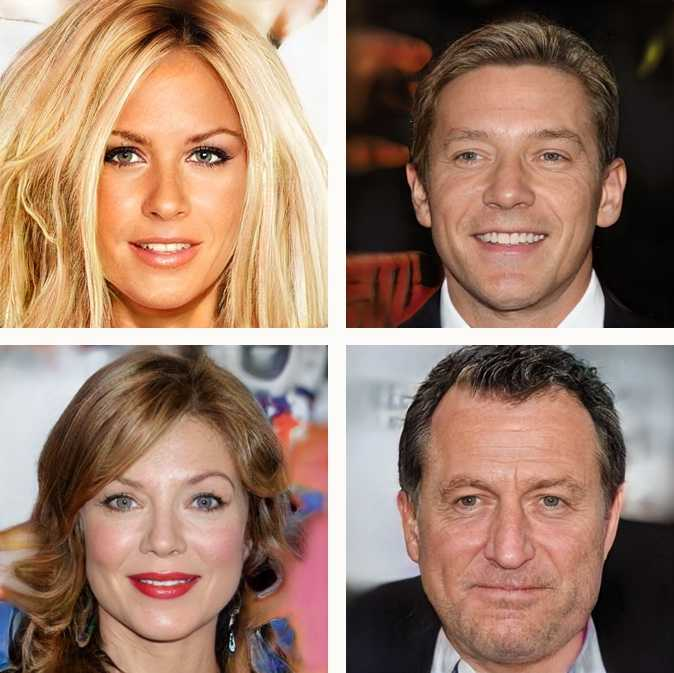

![img](data:image/svg+xml;base64,PD94bWwgdmVyc2lvbj0iMS4wIiBlbmNvZGluZz0iVVRGLTgiPz4KPHN2ZyB3aWR0aD0iOTIzcHgiIGhlaWdodD0iMjMwcHgiIHZpZXdCb3g9IjAgMCA5MjMgMjMwIiB2ZXJzaW9uPSIxLjEiIHhtbG5zPSJodHRwOi8vd3d3LnczLm9yZy8yMDAwL3N2ZyIgeG1sbnM6eGxpbms9Imh0dHA6Ly93d3cudzMub3JnLzE5OTkveGxpbmsiPgogICAgPCEtLSBHZW5lcmF0b3I6IFNrZXRjaCA0OSAoNTEwMDIpIC0gaHR0cDovL3d3dy5ib2hlbWlhbmNvZGluZy5jb20vc2tldGNoIC0tPgogICAgPHRpdGxlPkFydGJvYXJkIDIgQ29weTwvdGl0bGU+CiAgICA8ZGVzYz5DcmVhdGVkIHdpdGggU2tldGNoLjwvZGVzYz4KICAgIDxkZWZzPjwvZGVmcz4KICAgIDxnIGlkPSJBcnRib2FyZC0yLUNvcHkiIHN0cm9rZT0ibm9uZSIgc3Ryb2tlLXdpZHRoPSIxIiBmaWxsPSJub25lIiBmaWxsLXJ1bGU9ImV2ZW5vZGQiPgogICAgICAgIDxnIGlkPSJHcm91cC0yMi1Db3B5LTMiIHRyYW5zZm9ybT0idHJhbnNsYXRlKDIuMDAwMDAwLCAyNS4wMDAwMDApIj4KICAgICAgICAgICAgPGcgaWQ9Ikdyb3VwLTYiPgogICAgICAgICAgICAgICAgPGcgaWQ9Ikdyb3VwLTQiPgogICAgICAgICAgICAgICAgICAgIDxnIGlkPSJHcm91cC0xNi1Db3B5LTMiIHRyYW5zZm9ybT0idHJhbnNsYXRlKDQxLjM0MDIyNCwgMjYuMDAwMDAwKSI+CiAgICAgICAgICAgICAgICAgICAgICAgIDxwYXRoIGQ9Ik0zOTcuNDE1MiwxODYuODA1NTU2IEw0MjMuMjYyMTU2LDEyOS4wNDg0MjggTDQzMy42NTYyMTYsMTEzLjgyMjM2OCBMNDY5LjE0ODgxMSw0LjQwMzUwODc3IEw1NzUuNjg4NzA1LDEwNy43MDA1NjcgTDU4Mi43MTk1MjQsMjAuOTgyOTk1NSBMNDgyLjM1NjQ0MSw0LjQwMzUwODc3IEw0NDcuMzYzODMsOC44MzA1OTIxMSBMMzMzLjkwMTgwOSw1Ni44NzkyMDMyIEw0MjkuNzg2NzgxLDEyMC45MzA1NTYgTTUwOC43ODE5NzYsMTg2LjgwNTU1NiBMNDM3LjQ2OTc1MywxMjkuMDQ4NDI4IEw0NDIuODA0OTc3LDEyMC44ODM5NTUgTDU2OS4yNTcyNDQsMTA5LjUyMjY2MSBMNTcxLjU2NjE3MiwxMDkuNTIyNjYxIEw1NDQuMTA1OTE2LDE4Mi40MjgxOCBNNjMyLjM5MzU4MywxODIuNDI4MTggTDU3NS42ODg3MDUsMTA5LjUyMjY2MSIgaWQ9IlBhdGgtNjYiIHN0cm9rZT0iI0QwRTBFNSIgc3Ryb2tlLXdpZHRoPSI5Ij48L3BhdGg+CiAgICAgICAgICAgICAgICAgICAgICAgIDxwYXRoIGQ9Ik0zMTYuOTg5MzM0LDU5LjI4MDcwMTggTDIwMS4xNDg1MTIsNzIuNDcxODU2NyIgaWQ9IlBhdGgtOCIgc3Ryb2tlPSIjRDBFMEU1IiBzdHJva2Utd2lkdGg9IjkiPjwvcGF0aD4KICAgICAgICAgICAgICAgICAgICAgICAgPHBhdGggZD0iTTI2Ny45Mjg4NzMsMTI0Ljk2MzA4NSBMMTkyLjQwMzQ2NCw3My4yNjcxNzg0IiBpZD0iUGF0aC04IiBzdHJva2U9IiNEMEUwRTUiIHN0cm9rZS13aWR0aD0iOSI+PC9wYXRoPgogICAgICAgICAgICAgICAgICAgICAgICA8cGF0aCBkPSJNMTAwLjYzOTQ3MSwzNi4xOTc3MzM5IEwxOTIuNDAzNDY0LDczLjI2NzE3ODQiIGlkPSJQYXRoLTgiIHN0cm9rZT0iI0QwRTBFNSIgc3Ryb2tlLXdpZHRoPSI5Ij48L3BhdGg+CiAgICAgICAgICAgICAgICAgICAgICAgIDxwYXRoIGQ9Ik0yNDUuMjU4ODI5LDQuMDA1ODQ3OTUgTDE5Mi40MDM0NjQsNzMuMjY3MTc4NCIgaWQ9IlBhdGgtOCIgc3Ryb2tlPSIjRDBFMEU1IiBzdHJva2Utd2lkdGg9IjkiPjwvcGF0aD4KICAgICAgICAgICAgICAgICAgICAgICAgPHBhdGggZD0iTTI0NS4yNTg4MjksNC4wMDU4NDc5NSBMMzQwLjY1OTM0NSw2My42NTQ5NzA4IiBpZD0iUGF0aC04IiBzdHJva2U9IiNEMEUwRTUiIHN0cm9rZS13aWR0aD0iOSI+PC9wYXRoPgogICAgICAgICAgICAgICAgICAgICAgICA8cGF0aCBkPSJNMjQ1LjI1ODgyOSw0LjAwNTg0Nzk1IEwxMDQuNTQzMDY2LDMxLjg0MjEwNTMiIGlkPSJQYXRoLTgiIHN0cm9rZT0iI0QwRTBFNSIgc3Ryb2tlLXdpZHRoPSI5Ij48L3BhdGg+CiAgICAgICAgICAgICAgICAgICAgICAgIDxwYXRoIGQ9Ik05Ny4zODgwMjc2LDM3LjQwOTM1NjcgTDE2Ni41NTM0MDIsMTgxLjM2MjU3MyIgaWQ9IlBhdGgtOCIgc3Ryb2tlPSIjRDBFMEU1IiBzdHJva2Utd2lkdGg9IjkiPjwvcGF0aD4KICAgICAgICAgICAgICAgICAgICAgICAgPHBhdGggZD0iTTkyLjYxODAwMTcsMzUuMDIzMzkxOCBMMC4zOTc1MDIxNTMsMTUzLjUyNjMxNiIgaWQ9IlBhdGgtOCIgc3Ryb2tlPSIjRDBFMEU1IiBzdHJva2Utd2lkdGg9IjkiPjwvcGF0aD4KICAgICAgICAgICAgICAgICAgICAgICAgPHBhdGggZD0iTTI2Ny45Mjg4NzMsMTI0Ljk2MzA4NSBMMzMyLjMyNDIyMiw1OC45NTEzODg5IiBpZD0iUGF0aC04IiBzdHJva2U9IiNEMEUwRTUiIHN0cm9rZS13aWR0aD0iOSI+PC9wYXRoPgogICAgICAgICAgICAgICAgICAgICAgICA8cGF0aCBkPSJNMzQ5LjgxNDMxNywyMjUuOTY4OTMzIEwzMzIuMzI0MjIyLDU4Ljk1MTM4ODkiIGlkPSJQYXRoLTgiIHN0cm9rZT0iI0QwRTBFNSIgc3Ryb2tlLXdpZHRoPSI5Ij48L3BhdGg+CiAgICAgICAgICAgICAgICAgICAgICAgIDxwYXRoIGQ9Ik0yNjcuOTI4ODczLDEyNC45NjMwODUgTDE3MS43MzMzNTIsMTc2LjY1ODk5MSIgaWQ9IlBhdGgtOCIgc3Ryb2tlPSIjRDBFMEU1IiBzdHJva2Utd2lkdGg9IjkiPjwvcGF0aD4KICAgICAgICAgICAgICAgICAgICAgICAgPHBhdGggZD0iTTI3MS4xNTk3NzYsMTI2LjUgTDI2Ny45Mjg4NzMsMjE1LjYyOTc1MSIgaWQ9IlBhdGgtOCIgc3Ryb2tlPSIjRDBFMEU1IiBzdHJva2Utd2lkdGg9IjkiPjwvcGF0aD4KICAgICAgICAgICAgICAgICAgICAgICAgPHBhdGggZD0iTTU3Mi4yMzg1MSwxMDkuMTM0MzIgTDY3Ny4xODgzOTUsOTAuNDI1NjIxMyIgaWQ9IlBhdGgtMiIgc3Ryb2tlPSIjRDBFMEU1IiBzdHJva2Utd2lkdGg9IjkiPjwvcGF0aD4KICAgICAgICAgICAgICAgICAgICAgICAgPHBhdGggZD0iTTU4MS41NDU2NSwyMi4yOTgyNDU2IEw2NzcuMTg4Mzk1LDkwLjQyNTYyMTMiIGlkPSJQYXRoLTIiIHN0cm9rZT0iI0QwRTBFNSIgc3Ryb2tlLXdpZHRoPSI5Ij48L3BhdGg+CiAgICAgICAgICAgICAgICAgICAgICAgIDxwYXRoIGQ9Ik02NzYuMTUxMTYzLDgxLjk0NzM2ODQgTDY2NS44MTYxMDcsMC44MjQ1NjE0MDQiIGlkPSJQYXRoLTIiIHN0cm9rZT0iI0QwRTBFNSIgc3Ryb2tlLXdpZHRoPSI5Ij48L3BhdGg+CiAgICAgICAgICAgICAgICAgICAgICAgIDxwYXRoIGQ9Ik04MDcuMzI2ODczLDkxLjQ5MTIyODEgTDY2NS44MTYxMDcsMC44MjQ1NjE0MDQiIGlkPSJQYXRoLTIiIHN0cm9rZT0iI0QwRTBFNSIgc3Ryb2tlLXdpZHRoPSI5Ij48L3BhdGg+CiAgICAgICAgICAgICAgICAgICAgICAgIDxwYXRoIGQ9Ik04MDguOTE2ODgyLDkyLjI4NjU0OTcgTDgzOC4zMzIwNDEsMTkxLjcwMTc1NCIgaWQ9IlBhdGgtMiIgc3Ryb2tlPSIjRDBFMEU1IiBzdHJva2Utd2lkdGg9IjkiPjwvcGF0aD4KICAgICAgICAgICAgICAgICAgICAgICAgPHBhdGggZD0iTTgwOC45MTY4ODIsOTIuMjg2NTQ5NyBMNzE2LjY5NjM4MiwxNzEuMDIzMzkyIiBpZD0iUGF0aC0yIiBzdHJva2U9IiNEMEUwRTUiIHN0cm9rZS13aWR0aD0iOSI+PC9wYXRoPgogICAgICAgICAgICAgICAgICAgICAgICA8cGF0aCBkPSJNODA1LjczNjg2NSw5My4wODE4NzEzIEw2ODAuMTI2MTg0LDkwLjY5NTkwNjQiIGlkPSJQYXRoLTIiIHN0cm9rZT0iI0QwRTBFNSIgc3Ryb2tlLXdpZHRoPSI5Ij48L3BhdGg+CiAgICAgICAgICAgICAgICAgICAgICAgIDxwYXRoIGQ9Ik03MDcuMTU2MzMxLDE1MS45MzU2NzMgTDY4MC4xMjYxODQsOTAuNjk1OTA2NCIgaWQ9IlBhdGgtMiIgc3Ryb2tlPSIjRDBFMEU1IiBzdHJva2Utd2lkdGg9IjkiPjwvcGF0aD4KICAgICAgICAgICAgICAgICAgICAgICAgPGVsbGlwc2UgaWQ9Ik92YWwtNyIgZmlsbD0iIzEyNzRCRiIgY3g9IjQyNy43MTIzMTciIGN5PSIxMTkuNzI1MTQ2IiByeD0iMzcuMzY1MjAyNCIgcnk9IjM3LjM4MDExNyI+PC9lbGxpcHNlPgogICAgICAgICAgICAgICAgICAgICAgICA8ZWxsaXBzZSBpZD0iT3ZhbC03LUNvcHkiIGZpbGw9IiMxMjc0QkYiIGN4PSI3MTUuNDg5MjYyIiBjeT0iMTcxLjQzNTY3MyIgcng9IjI1LjQyNTUyMzgiIHJ5PSIyNS40MzU2NzI1Ij48L2VsbGlwc2U+CiAgICAgICAgICAgICAgICAgICAgICAgIDxlbGxpcHNlIGlkPSJPdmFsLTctQ29weS00IiBmaWxsPSIjMTI3NEJGIiBjeD0iODM5LjEyNzA0NiIgY3k9IjIwMC40NTAyOTIiIHJ4PSI0Mi41MzI3MzA0IiByeT0iNDIuNTQ5NzA3NiI+PC9lbGxpcHNlPgogICAgICAgICAgICAgICAgICAgICAgICA8ZWxsaXBzZSBpZD0iT3ZhbC03LUNvcHktMTIiIGZpbGw9IiMxMjc0QkYiIGN4PSI4MDcuMzI2ODczIiBjeT0iOTEuNDkxMjI4MSIgcng9IjIwLjI3MjYwOTgiIHJ5PSIyMC4yODA3MDE4Ij48L2VsbGlwc2U+CiAgICAgICAgICAgICAgICAgICAgICAgIDxlbGxpcHNlIGlkPSJPdmFsLTctQ29weS0yIiBmaWxsPSIjMTI3NEJGIiBjeD0iMzMzLjUwNDMwNyIgY3k9IjU4LjA4NzcxOTMiIHJ4PSIzMS40MDI2NzAxIiByeT0iMzEuNDE1MjA0NyI+PC9lbGxpcHNlPgogICAgICAgICAgICAgICAgICAgICAgICA8ZWxsaXBzZSBpZD0iT3ZhbC03LUNvcHktMyIgZmlsbD0iIzEyNzRCRiIgY3g9IjE2MC45ODgzNzIiIGN5PSIxNzcuMzg1OTY1IiByeD0iMzEuNDAyNjcwMSIgcnk9IjMxLjQxNTIwNDciPjwvZWxsaXBzZT4KICAgICAgICAgICAgICAgICAgICAgICAgPGVsbGlwc2UgaWQ9Ik92YWwtNy1Db3B5LTYiIGZpbGw9IiMxMjc0QkYiIGN4PSI1ODAuNzUwNjQ2IiBjeT0iMTkuOTEyMjgwNyIgcng9IjE2LjI5NzU4ODMiIHJ5PSIxNi4zMDQwOTM2Ij48L2VsbGlwc2U+CiAgICAgICAgICAgICAgICAgICAgICAgIDxlbGxpcHNlIGlkPSJPdmFsLTctQ29weS01IiBmaWxsPSIjMTI3NEJGIiBjeD0iNTcxLjYwODA5NiIgY3k9IjEwOS4zODU5NjUiIHJ4PSIyNi4yMzUxNDIxIiByeT0iMjYuMjQ1NjE0Ij48L2VsbGlwc2U+CiAgICAgICAgICAgICAgICAgICAgICAgIDxlbGxpcHNlIGlkPSJPdmFsLTctQ29weS0xMCIgZmlsbD0iIzEyNzRCRiIgY3g9IjY3OC45MzM2NzgiIGN5PSI5MS44ODg4ODg5IiByeD0iMjAuNjcwMTEyIiByeT0iMjAuNjc4MzYyNiI+PC9lbGxpcHNlPgogICAgICAgICAgICAgICAgICAgIDwvZz4KICAgICAgICAgICAgICAgICAgICA8ZWxsaXBzZSBpZD0iT3ZhbC03LUNvcHktNyIgZmlsbD0iIzEyNzRCRiIgY3g9IjUwOC40MDUyNTQiIGN5PSIyOC40MTUyMDQ3IiByeD0iMjguMjIyNjUyOSIgcnk9IjI4LjIzMzkxODEiPjwvZWxsaXBzZT4KICAgICAgICAgICAgICAgICAgICA8ZWxsaXBzZSBpZD0iT3ZhbC03LUNvcHktOSIgZmlsbD0iIzEyNzRCRiIgY3g9IjcwOC43NDYzMzkiIGN5PSIyOC40MTUyMDQ3IiByeD0iMjguMjIyNjUyOSIgcnk9IjI4LjIzMzkxODEiPjwvZWxsaXBzZT4KICAgICAgICAgICAgICAgICAgICA8ZWxsaXBzZSBpZD0iT3ZhbC03LUNvcHktOCIgZmlsbD0iIzEyNzRCRiIgY3g9IjIzMy43MzEyNjYiIGN5PSI5OC44MDExNjk2IiByeD0iMjMuODUwMTI5MiIgcnk9IjIzLjg1OTY0OTEiPjwvZWxsaXBzZT4KICAgICAgICAgICAgICAgICAgICA8ZWxsaXBzZSBpZD0iT3ZhbC03LUNvcHktMjAiIGZpbGw9IiMxMjc0QkYiIGN4PSIyODQuNjExNTQyIiBjeT0iMjkuNjA4MTg3MSIgcng9IjE1LjEwNTA4MTgiIHJ5PSIxNS4xMTExMTExIj48L2VsbGlwc2U+CiAgICAgICAgICAgICAgICAgICAgPGVsbGlwc2UgaWQ9Ik92YWwtNy1Db3B5LTE4IiBmaWxsPSIjMTI3NEJGIiBjeD0iMTM4LjcyODI1MiIgY3k9IjU5LjQzMjc0ODUiIHJ4PSIzMS40MDI2NzAxIiByeT0iMzEuNDE1MjA0NyI+PC9lbGxpcHNlPgogICAgICAgICAgICAgICAgICAgIDxlbGxpcHNlIGlkPSJPdmFsLTctQ29weS0xOSIgZmlsbD0iIzEyNzRCRiIgY3g9IjM2Ljk2NzcwMDMiIGN5PSIxODYuNjg0MjExIiByeD0iMzYuOTY3NzAwMyIgcnk9IjM2Ljk4MjQ1NjEiPjwvZWxsaXBzZT4KICAgICAgICAgICAgICAgICAgICA8ZWxsaXBzZSBpZD0iT3ZhbC03LUNvcHktMTEiIGZpbGw9IiMxMjc0QkYiIGN4PSIzMTEuNjQxNjg4IiBjeT0iMTUyLjA4NzcxOSIgcng9IjIyLjMyMTcwNTQiIHJ5PSIyMi4zMzA2MTUzIj48L2VsbGlwc2U+CiAgICAgICAgICAgICAgICA8L2c+CiAgICAgICAgICAgIDwvZz4KICAgICAgICA8L2c+CiAgICA8L2c+Cjwvc3ZnPg==)

## III .Gelişmiş sinir ağı teknikleri

### Önceki bölümde, çoğu sinir ağı yönteminin arkasındaki temel fikirleri tartıştık: çok katmanlı ağlar, doğrusal olmayan aktivasyon fonksiyonları ve backpropagation algoritması gibi öğrenme kuralları.

Onlar neredeyse tüm modern sinir ağı uygulamalarının güçlendiriyor. Bununla birlikte, birçok alanda derin öğrenmede büyük ilerlemelere yol açan temanın bazı ilginç ve güçlü varyasyonları vardır.

### Konvolüsyonel sinir ağları (CNN'ler)

Derin öğrenmenin olağanüstü bir başarı sağladığı alanlardan biri görüntü işlemedir. Önceki bölümde ayrıntılı olarak incelediğimiz basit sınıflandırıcı oldukça sınırlıdır - fark ettiğiniz gibi tüm gülen yüzleri doğru bir şekilde sınıflandırmak bile mümkün değildi. Ağa daha fazla katman eklemek ve ağırlıkları öğrenmek için geri yayılım kullanmak prensipte sorunu çözüyor, ancak bir başkası ortaya çıkıyor: ağırlıkların sayısı son derece büyük hale geliyor ve sonuç olarak tatmin edici bir doğruluk elde etmek için gereken egzersiz verilerinin miktarı çok büyük olmakta gerçekte.

Neyse ki, çok fazla ağırlık sorununa çok şık bir çözüm var: özel bir tür sinir ağı veya daha doğrusu, derin bir sinir ağına dahil edilebilecek özel bir katman türü. Bu özel tür katman, **evrişimli bir katmandır** . Evrişimli katmanları içeren **ağlara evrişimsel sinir ağları**(CNNs). Temel özellikleri parlak veya koyu (veya belirli renk) noktalar, çeşitli yönlerdeki kenarlar, desenler vb. Gibi görüntü özelliklerini algılayabilmeleridir. Bunlar, bir kedinin kulakları, bir köpeğin burnu, bir kişinin gözü veya bir durma işaretinin sekizgen şekli gibi daha soyut özellikleri tespit etmek için temel oluşturur. Girdi görüntünün piksellerine dayanarak bu özellikleri tespit etmek için normalde bir sinir ağını eğitmek zor olurdu, çünkü özellikler farklı konumlarda, farklı yönlerde ve görüntüdeki farklı boyutlarda görünebilir: nesneyi veya kamera açısını hareket ettirmek nesnenin kendisi aynı gözükse bile piksel değerlerini çarpıcı şekilde değiştirir. Tüm bu farklı koşullarda bir dur işareti tespit etmeyi öğrenmek için, çok miktarda eğitim verisi gerekir, çünkü ağ, sadece eğitim verilerinde göründüğü durumlarda oturum açmayı algılar. Bu nedenle, örneğin, görüntünün sağ üst köşesindeki bir dur işareti yalnızca eğitim verileri sağ üst köşede dur işareti olan bir görüntü içeriyorsa algılanır. CNN'ler, eğitim görüntülerinde nerede gözlemlendiğine bakmaksızın görüntüdeki herhangi bir nesneyi tanıyabilir.

> Not
>
> ## Neden CNN’lere ihtiyacımız var?
>
> CNN'ler, farklı koşullarda nesneleri algılamak için gereken egzersiz verisinin miktarını azaltmak için akıllıca bir numara kullanır. Püf noktası temel olarak birçok nöron için aynı girdi ağırlıklarını kullanmaktır - böylece tüm bu nöronlar aynı düzende aktive olur - ancak farklı giriş pikselleriyle. Örneğin, bir kedinin sivri kulağıyla harekete geçen bir dizi nöron olabilir. Girdi bir kedinin fotoğrafı olduğunda, biri sol kulak için diğeri sağ için olmak üzere iki nöron aktive edilir. Ayrıca nöronun giriş piksellerinin daha küçük veya daha büyük bir alandan alınmasına izin verebiliriz, böylece farklı nöronlar farklı ölçeklerde (boyutlarda) ortaya çıkan kulak tarafından aktive edilir, böylece sadece eğitim verisi olsa bile küçük bir kedinin kulaklarını tespit edebiliriz Büyük kedilerin görüntüleri dahil.

Evrişimli nöronlar tipik olarak ham girdi piksellerini işleyen ağın alt katmanlarına yerleştirilir. Bazik nöronlar (yukarıda tartışılan perceptron nöronu gibi) alt katmanların çıkışını işleyen daha yüksek katmanlara yerleştirilir. Alt katmanlar, genellikle göz önünde bulundurularak belirli bir tahmin görevi olmadan, denetimsiz öğrenme kullanılarak eğitilebilir. Giriş verilerinde sıkça görülen özellikleri algılamak için ağırlıkları ayarlanacaktır. Bu nedenle, hayvanların fotoğraflarıyla tipik özellikler kulaklar ve burunlar olacaktır; oysa bina görüntülerinde, özellikler duvarlar, çatılar, pencereler vb. Gibi mimari bileşenlerdir. Giriş verileri olarak çeşitli nesnelerin ve sahnelerin bir karışımı kullanılırsa, alt katmanlar tarafından öğrenilen özellikler aşağı yukarı genel olacaktır. Bu, önceden eğitilmiş evrişimli katmanların birçok farklı görüntü işleme görevinde tekrar kullanılabileceği anlamına gelir. Bu, son derece önemlidir çünkü neredeyse sınırsız miktarda etiketsiz eğitim verisi elde etmek kolaydır - etiketsiz görüntüler - alt katmanları eğitmek için kullanılabilir. Üst katmanlar her zaman geri yayılım gibi denetimli makine öğrenme teknikleri ile eğitilir.

### Sinir ağları elektrikli koyunları hayal ediyor mu? GAN: Generative adversarial networks (GAN:Çekişmeli Üretici Ağlar)

Verilerden bir sinir ağı öğrenmiş, tahmin için kullanılabilir. Ağın üst katmanları belirli bir sınıflandırma veya tahmin görevi gerçekleştirmek için denetimli bir şekilde eğitildiğinden, üst katmanlar yalnızca bu görev için gerçekten kullanışlıdır. Dur işaretlerini tespit etmek için eğitilmiş bir ağ, el yazısı rakamları veya kedileri tespit etmek için kullanışsızdır.

Önceden eğitilmiş alt katmanları alarak ve öğrendikleri özelliklerin nasıl göründüğünü inceleyerek büyüleyici bir sonuç elde edilir. Bu, alt katmanlardaki belirli bir nöron setini aktive eden görüntüler üretilerek elde edilebilir. Oluşturulan görüntülere baktığımızda, sinir ağının belirli bir özelliğin "nasıl olduğunu" düşündüğünü veya içinde belirli özelliklere sahip bir görüntünün nasıl görüneceğini görebiliriz. Hatta bazıları görüntüleri “hayal kurmak” veya “halüsinasyon” gibi ağlar hakkında konuşmayı da [seviyor](https://en.wikipedia.org/wiki/DeepDream) (bkz. Google'ın [DeepDream sistemi](https://en.wikipedia.org/wiki/DeepDream) ).

> Not
>
> ## Metaforlara dikkat edin
>
> Bununla birlikte, giriş görüntüsünün basit optimizasyonunun ne zaman yapılması gerektiğini hayal etmek gibi bir metaforla ilgili sorunu bir kez daha vurgulamak istiyoruz - Bölüm 1'de tartışılan bavul sözcüklerini hatırlayın. Sinir ağı gerçekten hayal etmiyor ve İnsanın anladığı gibi benzer bir şekilde anlayabileceği bir kedi kavramına sahip değil. Nesneleri tanımak için eğitilmiştir ve üzerinde çalıştığı giriş verilerine benzer görüntüler üretebilir.

Gerçekte gerçek görünümlü kediler, insan yüzleri veya diğer nesneleri (eğitim verileri olarak ne kullanırsanız , onu alırsınız) üretmek için, şu anda Google [Beyin’de](https://en.wikipedia.org/wiki/Ian_Goodfellow) çalışan [Ian Goodfellow](https://en.wikipedia.org/wiki/Ian_Goodfellow) iki sinir ağının akıllıca bir kombinasyonunu önerdi. Fikir iki ağın birbiriyle rekabet etmesine izin vermektir. Ağlardan biri, eğitim verilerindeki gibi görüntüler üretmek için eğitilmiştir. Diğer ağın görevi, ilk ağ tarafından oluşturulan görüntüleri eğitim verilerinden ve  gerçek görüntülerden ayırmaktır - buna rakip ağ denir ve tüm sisteme üretici rakip ağ veya GAN denir.

Sistem iki modeli yan yana eğitiyor. Eğitimin başında, rakip modelin gerçek verileri eğitim verilerinden ve üretken modelin sakar girişimlerinden ayırmak için kolay bir görevi vardır. Bununla birlikte, üretici ağ yavaş yavaş daha iyi ve daha iyi hale geldikçe, rakip modelin de gelişmesi gerekir ve sonuçta üretilen görüntüler neredeyse gerçeklerden ayırt edilemez olana kadar devam eder. GAN, sadece eğitim verilerindeki görüntüleri çoğaltmaya çalışmaz: yanında rakip ağı yenmek için çok basit bir strateji olabilir. Ancak, sistem, yeni ve gerçek görünümlü görüntüler üretebilmek için de eğitilmiştir.

Yukarıdaki görüntüler NVIDIA tarafından [Prof Jaakko Lehtinen](https://users.aalto.fi/~lehtinj7/) tarafından yürütülen bir projede geliştirilen bir GAN tarafından üretildi ( [daha fazla ayrıntı için bu makaleye bakın](https://www.technologyreview.com/the-download/609290/meet-the-fake-celebrities-dreamed-up-by-ai/) ).

Onları sahte olarak tanıyabilir miydin?

### Bölüm 5'i tamamladıktan sonra:

- Bir sinir ağının ne olduğunu ve nerede başarıyla kullanıldığını açıklayın.
- Yapay sinir ağlarını destekleyen teknik yöntemleri anlayın